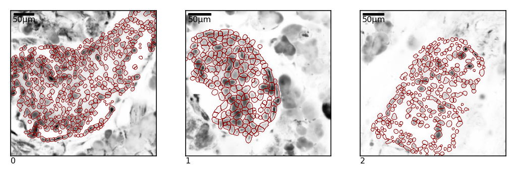
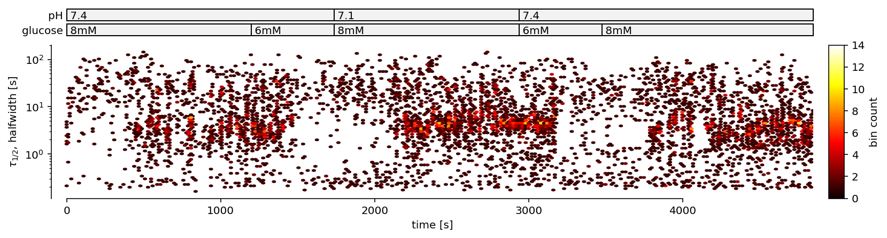
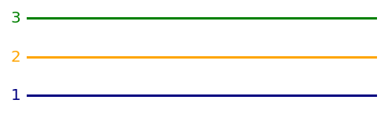
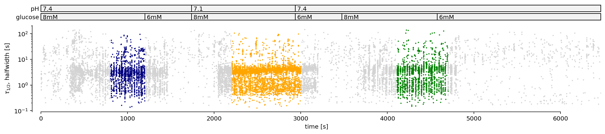
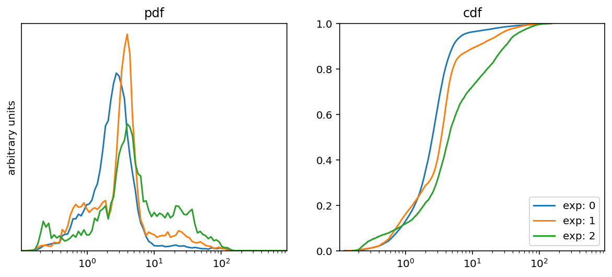
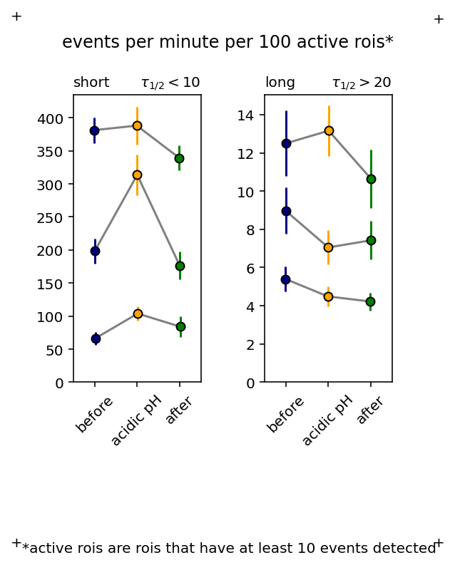
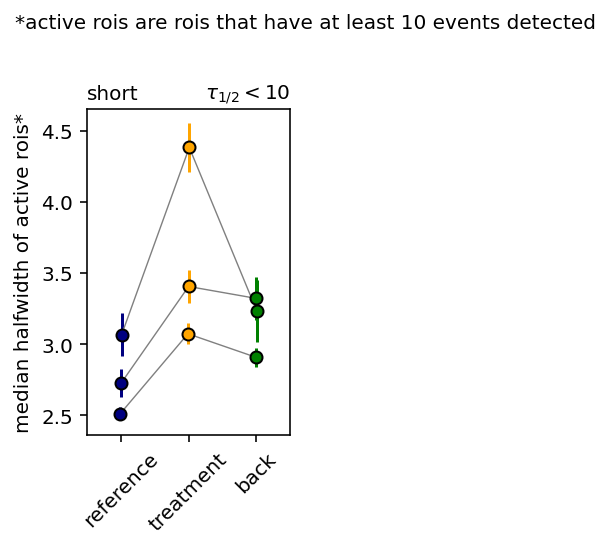
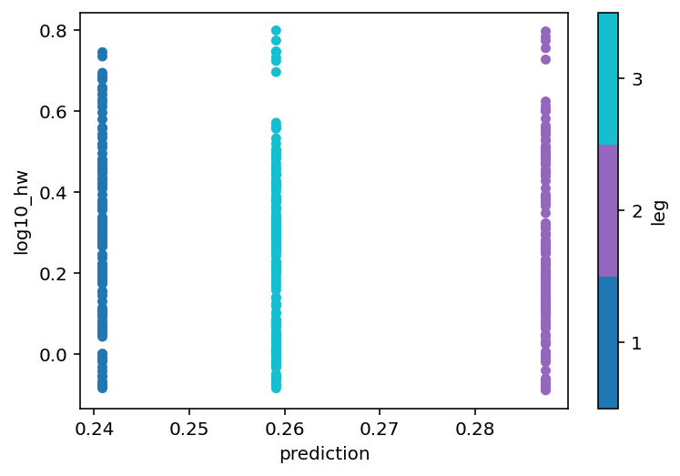

```python
# Importing 
%load_ext autoreload
%autoreload 2
import pandas as pd
import numpy as np
import os
import islets
import matplotlib.pyplot as plt
%config InlineBackend.figure_format = 'retina'
import islets._manuscript_functions as mf
import statsmodels.api as sm
from tqdm.notebook import tqdm
```


```python
from IPython.core.display import display, HTML, Image
display(HTML("<style>.container { width:90% !important; }</style>"))
```


<style>.container { width:90% !important; }</style>


## Importing paths

To pool experiments, we first need to prepare a table with the paths to corresponding regions. Here, I show an example of such a file containing also some other important data like strain and glucose, but you can put whatever you think is useful.

This is how the file looks like. You can write it directly though out server, or you can manipulate the table in Excel and then export it to csv


```python
pathToFile = "step4_example_0.csv"
print (open(pathToFile).read())
```

    strain,glucose,path
    BL6J,8,/data/Sandra/2021/2021_04_27/Experiment112b.lif_analysis/Series001-4/2022_01_06_5_rois.pkl
    BL6J,8,/data/Sandra/2021/2021_04_27/Experiment112d.lif_analysis/Series002-5/2022_01_06_6_rois.pkl
    BL6J,8,/data/Sandra/2021/2021_04_28/Experiment113a.lif_analysis/Series008-10/2022_01_06_5_rois.pkl
    


Let's import it to notebook.


```python
data = pd.read_csv(pathToFile)
data
```


<div>
<style scoped>
    .dataframe tbody tr th:only-of-type {
        vertical-align: middle;
    }

    .dataframe tbody tr th {
        vertical-align: top;
    }

    .dataframe thead th {
        text-align: right;
    }
</style>
<table border="1" class="dataframe">
  <thead>
    <tr style="text-align: right;">
      <th></th>
      <th>strain</th>
      <th>glucose</th>
      <th>path</th>
    </tr>
  </thead>
  <tbody>
    <tr>
      <th>0</th>
      <td>BL6J</td>
      <td>8</td>
      <td>/data/Sandra/2021/2021_04_27/Experiment112b.li...</td>
    </tr>
    <tr>
      <th>1</th>
      <td>BL6J</td>
      <td>8</td>
      <td>/data/Sandra/2021/2021_04_27/Experiment112d.li...</td>
    </tr>
    <tr>
      <th>2</th>
      <td>BL6J</td>
      <td>8</td>
      <td>/data/Sandra/2021/2021_04_28/Experiment113a.li...</td>
    </tr>
  </tbody>
</table>
</div>


Let's iterate through the rows, import regions and show them to get an idea of how they look.


```python
nc = 5
nr = int(np.ceil(len(data)/nc))
fig, axs = plt.subplots(nr,nc,figsize=(3*nc,3*nr))
ia = 0
for i in data.index:
    path = data.loc[i,"path"]
    ## here we load the regions if we didn't ye
    if "regions" in data.columns and isinstance(data.loc[i,"regions"], islets.Regions):
        regions = data.loc[i,"regions"]
    else:
        regions = islets.load_regions(path)
        data.loc[i,"regions"] = [regions]
    ## here we plot the regions
    ax = axs.flat[ia]
    regions.plotEdges(ax=ax, scaleFontSize=8)
    ia += 1
    ax.set_xticks([])
    ax.set_yticks([])
    ax.text(0,-.01,str(i),size=8,va="top",transform=ax.transAxes)
# remove unused axes
for ax in axs.flat[ia:]:
    ax.remove()
```





If we are happy with what you see, you go further.

## Importing Events

I will assume that all of the regions above have been processed for events, and that the events are saved in a csv file which shares most of the filepath with the regions path.


```python
for i in data.index:
    # construct events_path from the roi path
    path = data.loc[i,"path"]
    events_path = path.replace("_rois.pkl","_auto_events.csv")
    # regions are in our table now
    regions = data.loc[i,"regions"]
    # reading events each time from the file is very fast
    Events = pd.read_csv(events_path, index_col=0)
    # plot events
    mf.plot_events(Events, regions)
```





## Defining legs

Now, we will proceed to define legs for each of the regions. In this setup, we are dealing with triple protocols in each case, where the second glucose stimulation is manipulated with pH of 7.1. Let's call the legs `'1'`, `'2'`, and `'3'` for simplicity, but it could be anyting, as long as the they are unique (e.g. `'pH7.4 pre'`, `'7.1'`, `'pH7.4 post'`).

### Directly in notebook (for illustrative purposes only)

You can define the legs for each experiment manually:


```python
data["legs"] = [
    {"1":(600,1300), "2":(2300,3000), "3": (4000,4800)}, # first experiment
    {"1":(800,1200), "2":(2200,3000), "3": (4100,4700)}, # second experiment
    {"1":(700,1300), "2":(2300,3100), "3": (4100,4800)}, # etc. you got the point
]
```

Let's also define a color scheme we'll use throughout.  
(Remember there is a [reference of some of the named colors](https://matplotlib.org/stable/gallery/color/named_colors.html?highlight=named).)


```python
legColors = {"1":"navy", "2": "orange", "3": "green"}

# lets also plot them to see if python understands what we wrote and if we like them
_, ax = plt.subplots(1,1,figsize = (4,len(legColors)/3))
for il,leg in enumerate(legColors):
    ax.axhline(il,color=legColors[leg])
    ax.text(0,il,leg+" ", va="center", ha="right", color=legColors[leg])
mf.mystyle_axes(ax)
```





```python
legList = list(legColors.keys())
```

So, we can now plot the hexbins and emphasize the legs


```python
for i in data.index:
    # construct events_path from the roi path
    path = data.loc[i,"path"]
    events_path = path.replace("_rois.pkl","_auto_events.csv")
    # regions are in our table now
    regions = data.loc[i,"regions"]
    # reading events each time from the file is very fast
    Events = pd.read_csv(events_path, index_col=0)
    # get legs from the table
    legs = data.loc[i,"legs"]
    islets.EventDistillery.define_legs(Events, legs)
    # plot events
    mf.plot_events(Events, regions, plottype="scatter", legColorDict=legColors)
    # alternatively, you can omit the plottype to get hexbin and then 
    # emphasize legs with frames, or the big_plot which does it automatically,
    # see Step3 for variations
```





### Store legs directly in the csv file (strongly recommended!)

But, it is typically more useful to store the legs directly in the csv. For example, the following csv file contains the legs as one of the columns:


```python
pathToFile = "step4_example_1.csv"
print (open(pathToFile).read())
```

    legs,strain,glucose,task,path
    "{'1':(600,1300),'2':(2338,3058),'3':(4077,4797)}",BL6J,,,/data/Sandra/2021/2021_04_27/Experiment112b.lif_analysis/Series001-4/2022_01_06_5_rois.pkl
    "{'1':(600,1300),'2':(2338,3058),'3':(4077,4697)}",BL6J,,,/data/Sandra/2021/2021_04_27/Experiment112d.lif_analysis/Series002-5/2022_01_06_6_rois.pkl
    "{'1':(600,1200),'2':(2438,3058),'3':(4177,4800)}",BL6J,,,/data/Sandra/2021/2021_04_28/Experiment113a.lif_analysis/Series008-10/2022_01_06_5_rois.pkl


Note that the entry for legs needs to have quotes (and curly brackets) surrounding it, otherwise it would look like there is way too many columns (csv == "comma separated values").

I could have imported that file and then I would have the column `legs`, which would contain strings.

In that case I will need to run the following line to transform entries in that column into form we need:
```
data["legs"] = [eval(legs) for legs in data["legs"]]

```

I strongly recommend you do it so in your scripts. It is good practice to keep important parameters closer to the data.

In case you first defined your legs in the notebook, and are lazy to enter them manually in the csv file, the following may halp you with that:


```python
for legs in data['legs']:
    print ('"' + repr(legs).replace(" ","") + '"')
```

    "{'1':(600,1300),'2':(2300,3000),'3':(4000,4800)}"
    "{'1':(800,1200),'2':(2200,3000),'3':(4100,4700)}"
    "{'1':(700,1300),'2':(2300,3100),'3':(4100,4800)}"


So you can just copy the lines here and paste them into the csv directly (or copy the full output and paste it into excel worksheet you are using to create the csv.

In principle, I immagine you will examine each of these experiment separately, in separate notebooks, on separate days, and define their legs then and there. You can then just use those legs and put them in the csv file. 

## Analysis of event rates

basic (normalized) histogram, and cumulative density function of events in all experiments.


```python
hwBinEdges = np.geomspace(start = .1, stop = 1000, num = 100)
hwBinCenters = np.sqrt( hwBinEdges[1:] * hwBinEdges[:-1])
fig, axs = plt.subplots(1,2,figsize=(10,4))
axs[0].set_title("pdf")
axs[1].set_title("cdf")
for ax in axs:
    ax.set_xscale("log")
for i in data.index:
    # construct events_path from the roi path
    path = data.loc[i,"path"] 
    events_path = path.replace("_rois.pkl","_auto_events.csv")
    # reading events each time from the file is very fast
    Events = pd.read_csv(events_path, index_col=0)
    x = Events["halfwidth"].values.copy()
    h = np.histogram(x, hwBinEdges)[0]
    h = h/h.sum()
    axs[0].plot(hwBinCenters, h, label=f"exp: {i}")
    x.sort()
    axs[1].plot(x, np.linspace(0,1,len(x)), label=f"exp: {i}")
axs[0].set_ylim(0,)
axs[0].set_yticks([])
axs[0].set_ylabel("arbitrary units")
axs[1].set_ylim(0,1)
for ax in axs:
    ax.set_xlim(hwBinCenters[[0,-1]])
axs[1].legend(loc=4)
```


    <matplotlib.legend.Legend at 0x7fb755884940>





Say we are interested in two types of events: below 10s and above 20s


```python
hwRegions = {
    "short": (0.2,10),
    "long":  ( 20,300),
}
```


```python
# we again iterate over rows of data, this time collecting the important objects for each experiment:
allEpmpr = []
minEvents = 10
# ... 
for i in data.index:
    # ... import events, ...
    path = data.loc[i,"path"] 
    events_path = path.replace("_rois.pkl","_auto_events.csv")
    Events = pd.read_csv(events_path, index_col=0)
    # define legs
    islets.EventDistillery.define_legs(Events, data.loc[i,"legs"])
    # ... calculate events per min per active roi, ...
    evpmpar = mf.get_events_per_min_per_nrois(  # <-- see Step3 for an explanation what this does
        Events,
        hwRegions,
        minEvents=minEvents,
        reduceRois=2,
        Nbootstrap=30
    )
    # ... we label result with the experiment index
    expLabel = "exp"+str(i)
    evpmpar["experiment"] = expLabel
    ## and collect it into the big list
    allEpmpr += [evpmpar]
```

    There are 246 rois with more than 10 events (67%).
    Out of them, 123 are sampled 30 times to estimate mean and std of the firing rate.
    There are 109 rois with more than 10 events (60%).
    Out of them, 54 are sampled 30 times to estimate mean and std of the firing rate.
    There are 94 rois with more than 10 events (37%).
    Out of them, 47 are sampled 30 times to estimate mean and std of the firing rate.


We create one big tabel out of the big list


```python
allEpmpr = pd.concat(allEpmpr,ignore_index=True)
```

Let have a look at what we got:


```python
allEpmpr.sort_values(["experiment","hw_region"])
```


<div>
<style scoped>
    .dataframe tbody tr th:only-of-type {
        vertical-align: middle;
    }

    .dataframe tbody tr th {
        vertical-align: top;
    }

    .dataframe thead th {
        text-align: right;
    }
</style>
<table border="1" class="dataframe">
  <thead>
    <tr style="text-align: right;">
      <th></th>
      <th>hw_region</th>
      <th>leg</th>
      <th>epmpr</th>
      <th>epmpr_std</th>
      <th>experiment</th>
    </tr>
  </thead>
  <tbody>
    <tr>
      <th>1</th>
      <td>long</td>
      <td>1</td>
      <td>0.054021</td>
      <td>0.006619</td>
      <td>exp0</td>
    </tr>
    <tr>
      <th>3</th>
      <td>long</td>
      <td>2</td>
      <td>0.044888</td>
      <td>0.005177</td>
      <td>exp0</td>
    </tr>
    <tr>
      <th>5</th>
      <td>long</td>
      <td>3</td>
      <td>0.042222</td>
      <td>0.004644</td>
      <td>exp0</td>
    </tr>
    <tr>
      <th>0</th>
      <td>short</td>
      <td>1</td>
      <td>3.812833</td>
      <td>0.194134</td>
      <td>exp0</td>
    </tr>
    <tr>
      <th>2</th>
      <td>short</td>
      <td>2</td>
      <td>3.881444</td>
      <td>0.284153</td>
      <td>exp0</td>
    </tr>
    <tr>
      <th>4</th>
      <td>short</td>
      <td>3</td>
      <td>3.392652</td>
      <td>0.191478</td>
      <td>exp0</td>
    </tr>
    <tr>
      <th>7</th>
      <td>long</td>
      <td>1</td>
      <td>0.089653</td>
      <td>0.012126</td>
      <td>exp1</td>
    </tr>
    <tr>
      <th>9</th>
      <td>long</td>
      <td>2</td>
      <td>0.070506</td>
      <td>0.008906</td>
      <td>exp1</td>
    </tr>
    <tr>
      <th>11</th>
      <td>long</td>
      <td>3</td>
      <td>0.074221</td>
      <td>0.010116</td>
      <td>exp1</td>
    </tr>
    <tr>
      <th>6</th>
      <td>short</td>
      <td>1</td>
      <td>1.985253</td>
      <td>0.186499</td>
      <td>exp1</td>
    </tr>
    <tr>
      <th>8</th>
      <td>short</td>
      <td>2</td>
      <td>3.135899</td>
      <td>0.312106</td>
      <td>exp1</td>
    </tr>
    <tr>
      <th>10</th>
      <td>short</td>
      <td>3</td>
      <td>1.765359</td>
      <td>0.211154</td>
      <td>exp1</td>
    </tr>
    <tr>
      <th>13</th>
      <td>long</td>
      <td>1</td>
      <td>0.125018</td>
      <td>0.017007</td>
      <td>exp2</td>
    </tr>
    <tr>
      <th>15</th>
      <td>long</td>
      <td>2</td>
      <td>0.131596</td>
      <td>0.013362</td>
      <td>exp2</td>
    </tr>
    <tr>
      <th>17</th>
      <td>long</td>
      <td>3</td>
      <td>0.106356</td>
      <td>0.015385</td>
      <td>exp2</td>
    </tr>
    <tr>
      <th>12</th>
      <td>short</td>
      <td>1</td>
      <td>0.661707</td>
      <td>0.101757</td>
      <td>exp2</td>
    </tr>
    <tr>
      <th>14</th>
      <td>short</td>
      <td>2</td>
      <td>1.038237</td>
      <td>0.110378</td>
      <td>exp2</td>
    </tr>
    <tr>
      <th>16</th>
      <td>short</td>
      <td>3</td>
      <td>0.840364</td>
      <td>0.152303</td>
      <td>exp2</td>
    </tr>
  </tbody>
</table>
</div>


Let's plot


```python
# in the order you want it to appear in the plot
legs = ["1","2","3"]
```


```python
exps = list(allEpmpr["experiment"].unique())
```


```python
jitter = .01 # how much you wish to stagger the points in the plot below
allEpmpr["plot_pos"] = allEpmpr["leg"].apply(lambda xi: legs.index(xi)) + allEpmpr["experiment"].apply(lambda xi: exps.index(xi)-(len(exps)-1)/2)*jitter
```


```python
rescale = 100 # rescale to values you can change it if you wish
fig, axs = plt.subplots(1,len(hwRegions),figsize=(1+len(hwRegions)*len(legColors)*.5,5))
plt.subplots_adjust(wspace=.5, top = .86, bottom = .3)

if rescale>1:
    fig.suptitle(f"events per minute per {rescale} active rois*")
else:
    fig.suptitle(f"events per minute per active roi*\n")
if len(hwRegions)==1:
    axs = [axs]
for ia,hwr in enumerate(hwRegions):
    ax = axs[ia]
    for exp,df in allEpmpr.query(f"hw_region=='{hwr}'").groupby("experiment"):
        ax.plot(df['plot_pos'],rescale*df['epmpr'], "grey")
    for leg in legs:
        df = allEpmpr.query(f"hw_region=='{hwr}' and leg=='{leg}'").copy()
        ax.errorbar(df['plot_pos'],df["epmpr"]*rescale,df["epmpr_std"]*rescale,color=legColors[leg], marker="o",ls="none", mec="k")
    ax.text(0,1.03,hwr, transform=ax.transAxes)
    ax.set_xlim(-.5,int(allEpmpr["plot_pos"].max())+.5)
    ax.set_ylim(0,)
    
# xticks
## whatch out what you put here. it will depend on your cases!
legNames = ["before","acidic pH", "after"]
# set the ticks:
for ax in axs:
    xmax = ax.get_xlim()[1]
    ax.set_xticks(np.arange(int(xmax)+1))
    ax.set_xticklabels(legNames, rotation=45)

#################### anything below this is kinda optional ################################

# some more details (optional and almost hard-coded, you will need to change it if you change hwRegions!!)
axs[0].text(1,1.03,r"$\tau_{1/2}<%g$"%hwRegions["short"][1],ha="right",transform=axs[0].transAxes)
axs[1].text(1,1.03,r"$\tau_{1/2}>%g$"%hwRegions["long"][0],ha="right",transform=axs[1].transAxes)
    
# put the disclaimer (it will not be saved)
# you can just delete the line if you don't like seeing it
fig.text(0,-.01,f"*active rois are rois that have at least {minEvents} events detected",va="top", )

# saving
fig.text(0,0,"+",ha="right",va="top")
fig.text(0,1,"+",ha="right",va="bottom")
fig.text(1,1,"+")
fig.text(1,0,"+",va="top",ha="left")
## only the region of the plot between "+"s is saved
fig.savefig("example_plot.png", dpi = 300) 
```





We can try to run a mixed linear model where groups are experiments, but this might not bring much in some cases (too few experiments)


```python
# For the long events
rateResult = mf.get_rate_effect(allEpmpr.query("hw_region=='long'"))
```


<style type="text/css">
            /* Fix details summary arrow
               not shown in Firefox
               due to bootstrap
               display: block;
             */
            summary {
                display: list-item;
            }
            </style><div>reference leg: 1</div><table><tr><td style="text-align:left">Obtained effect for leg '<span style='font-family:monospace'>2</span>':</td><td>-12%,</td><td>with the p-value of 0.073</td></tr><tr><td style="text-align:left">Obtained effect for leg '<span style='font-family:monospace'>3</span>':</td><td>-18%,</td><td>with the p-value of 0.0042</td></tr></table><details><summary style='color:navy'>full output</summary><table class="simpletable">
<tr>
       <td>Model:</td>       <td>MixedLM</td> <td>Dependent Variable:</td> <td>log10_epmpr</td>
</tr>
<tr>
  <td>No. Observations:</td>    <td>9</td>          <td>Method:</td>          <td>REML</td>    
</tr>
<tr>
     <td>No. Groups:</td>       <td>3</td>          <td>Scale:</td>          <td>0.0014</td>   
</tr>
<tr>
  <td>Min. group size:</td>     <td>3</td>      <td>Log-Likelihood:</td>     <td>5.0948</td>   
</tr>
<tr>
  <td>Max. group size:</td>     <td>3</td>        <td>Converged:</td>          <td>Yes</td>    
</tr>
<tr>
  <td>Mean group size:</td>    <td>3.0</td>            <td></td>                <td></td>      
</tr>
</table>
<table class="simpletable">
<tr>
               <td></td>                <th>Coef.</th> <th>Std.Err.</th>    <th>z</th>   <th>P>|z|</th> <th>[0.025</th> <th>0.975]</th>
</tr>
<tr>
  <th>Intercept</th>                   <td>-1.073</td>   <td>0.120</td>  <td>-8.939</td> <td>0.000</td> <td>-1.308</td> <td>-0.837</td>
</tr>
<tr>
  <th>C(leg, Treatment('1'))[T.2]</th> <td>-0.054</td>   <td>0.030</td>  <td>-1.795</td> <td>0.073</td> <td>-0.113</td>  <td>0.005</td>
</tr>
<tr>
  <th>C(leg, Treatment('1'))[T.3]</th> <td>-0.086</td>   <td>0.030</td>  <td>-2.864</td> <td>0.004</td> <td>-0.146</td> <td>-0.027</td>
</tr>
<tr>
  <th>experiment Var</th>               <td>0.042</td>   <td>1.401</td>     <td></td>      <td></td>       <td></td>       <td></td>   
</tr>
</table></details>


```python
# For the short events
rateResult = mf.get_rate_effect(allEpmpr.query("hw_region=='short'"))
```


<style type="text/css">
            /* Fix details summary arrow
               not shown in Firefox
               due to bootstrap
               display: block;
             */
            summary {
                display: list-item;
            }
            </style><div>reference leg: 1</div><table><tr><td style="text-align:left">Obtained effect for leg '<span style='font-family:monospace'>2</span>':</td><td>+36%,</td><td>with the p-value of 0.021</td></tr><tr><td style="text-align:left">Obtained effect for leg '<span style='font-family:monospace'>3</span>':</td><td>+0.16%,</td><td>with the p-value of 0.99</td></tr></table><details><summary style='color:navy'>full output</summary><table class="simpletable">
<tr>
       <td>Model:</td>       <td>MixedLM</td> <td>Dependent Variable:</td> <td>log10_epmpr</td>
</tr>
<tr>
  <td>No. Observations:</td>    <td>9</td>          <td>Method:</td>          <td>REML</td>    
</tr>
<tr>
     <td>No. Groups:</td>       <td>3</td>          <td>Scale:</td>          <td>0.0051</td>   
</tr>
<tr>
  <td>Min. group size:</td>     <td>3</td>      <td>Log-Likelihood:</td>     <td>1.5393</td>   
</tr>
<tr>
  <td>Max. group size:</td>     <td>3</td>        <td>Converged:</td>          <td>Yes</td>    
</tr>
<tr>
  <td>Mean group size:</td>    <td>3.0</td>            <td></td>                <td></td>      
</tr>
</table>
<table class="simpletable">
<tr>
               <td></td>               <th>Coef.</th> <th>Std.Err.</th>   <th>z</th>   <th>P>|z|</th> <th>[0.025</th> <th>0.975]</th>
</tr>
<tr>
  <th>Intercept</th>                   <td>0.233</td>   <td>0.193</td>  <td>1.210</td> <td>0.226</td> <td>-0.144</td>  <td>0.611</td>
</tr>
<tr>
  <th>C(leg, Treatment('1'))[T.2]</th> <td>0.134</td>   <td>0.058</td>  <td>2.307</td> <td>0.021</td>  <td>0.020</td>  <td>0.248</td>
</tr>
<tr>
  <th>C(leg, Treatment('1'))[T.3]</th> <td>0.001</td>   <td>0.058</td>  <td>0.012</td> <td>0.990</td> <td>-0.113</td>  <td>0.115</td>
</tr>
<tr>
  <th>experiment Var</th>              <td>0.106</td>   <td>1.861</td>    <td></td>      <td></td>       <td></td>       <td></td>   
</tr>
</table></details>


The results are consistent with the hypothesis that only the burst frequency changes in pH 7.1 and that the effect is at least partially reversable.

For the confidence interval see full output. You will need to transform the numbers in the same way as shown in Step3 notebook for halfwidths.

## Total activity
sum of AUCs independent of event type (halfwidth)
activity = sum of all AUCs, per active roi, per minute. Dimensionless. Error bar represents variation due to different rois.


```python
allActs = []
minEvents = 10
# ... 
for i in data.index:
    # ... import events, ...
    path = data.loc[i,"path"] 
    events_path = path.replace("_rois.pkl","_auto_events.csv")
    Events = pd.read_csv(events_path, index_col=0)
    # define legs
    islets.EventDistillery.define_legs(Events, data.loc[i,"legs"])
    # ... calculate events per min per active roi, ...
    act = mf.get_activity(
        Events,
        minEvents=minEvents,
        reduceRois=2,
        Nbootstrap=30
    )
    # ... we label result with the experiment index
    expLabel = "exp"+str(i)
    act["experiment"] = expLabel
    ## and collect it into the big list
    allActs += [act]
```

    There are 246 rois with more than 10 events (67%).
    Out of them, 123 are sampled 30 times to estimate mean and std of the activity.
    There are 109 rois with more than 10 events (60%).
    Out of them, 54 are sampled 30 times to estimate mean and std of the activity.
    There are 94 rois with more than 10 events (37%).
    Out of them, 47 are sampled 30 times to estimate mean and std of the activity.


```python
allActs = pd.concat(allActs, ignore_index=True)
```


```python
allActs
```


<div>
<style scoped>
    .dataframe tbody tr th:only-of-type {
        vertical-align: middle;
    }

    .dataframe tbody tr th {
        vertical-align: top;
    }

    .dataframe thead th {
        text-align: right;
    }
</style>
<table border="1" class="dataframe">
  <thead>
    <tr style="text-align: right;">
      <th></th>
      <th>leg</th>
      <th>activity</th>
      <th>activity_std</th>
      <th>experiment</th>
    </tr>
  </thead>
  <tbody>
    <tr>
      <th>0</th>
      <td>1</td>
      <td>1.377258</td>
      <td>0.085830</td>
      <td>exp0</td>
    </tr>
    <tr>
      <th>1</th>
      <td>2</td>
      <td>1.536723</td>
      <td>0.107639</td>
      <td>exp0</td>
    </tr>
    <tr>
      <th>2</th>
      <td>3</td>
      <td>1.485416</td>
      <td>0.106293</td>
      <td>exp0</td>
    </tr>
    <tr>
      <th>3</th>
      <td>1</td>
      <td>0.998074</td>
      <td>0.127649</td>
      <td>exp1</td>
    </tr>
    <tr>
      <th>4</th>
      <td>2</td>
      <td>1.324812</td>
      <td>0.112890</td>
      <td>exp1</td>
    </tr>
    <tr>
      <th>5</th>
      <td>3</td>
      <td>1.173806</td>
      <td>0.105269</td>
      <td>exp1</td>
    </tr>
    <tr>
      <th>6</th>
      <td>1</td>
      <td>1.315019</td>
      <td>0.180890</td>
      <td>exp2</td>
    </tr>
    <tr>
      <th>7</th>
      <td>2</td>
      <td>1.574210</td>
      <td>0.256280</td>
      <td>exp2</td>
    </tr>
    <tr>
      <th>8</th>
      <td>3</td>
      <td>1.185142</td>
      <td>0.161604</td>
      <td>exp2</td>
    </tr>
  </tbody>
</table>
</div>


```python
jitter = .01 # how much you wish to stagger the points in the plot below
allActs["plot_pos"] = allActs["leg"].apply(lambda xi: legs.index(xi)) + allActs["experiment"].apply(lambda xi: exps.index(xi)-(len(exps)-1)/2)*jitter
```


```python
fig, ax = plt.subplots(1,1,figsize=(1+len(legColors)*.5,5))
plt.subplots_adjust(wspace=.5, top = .86, bottom = .3)

for exp,df in allActs.groupby("experiment"):
    ax.plot(df['plot_pos'],df['activity'], "grey")
for leg in legs:
    df = allActs.query(f"leg=='{leg}'").copy()
    ax.errorbar(df['plot_pos'],df["activity"],df["activity_std"],color=legColors[leg], marker="o",ls="none", mec="k")
ax.set_xlim(-.5,int(allEpmpr["plot_pos"].max())+.5)
ax.set_ylim(0,)
xmax = ax.get_xlim()[1]
ax.set_xticks(np.arange(int(xmax)+1))
ax.set_xticklabels(legNames, rotation=45)
ax.set_ylabel("activity [a.u.]")
```


    Text(0, 0.5, 'activity [a.u.]')


```python
# we use the same function as for the rate, but we need additional argument to make it work for activity
mf.get_rate_effect(allActs, "activity")
```


<style type="text/css">
            /* Fix details summary arrow
               not shown in Firefox
               due to bootstrap
               display: block;
             */
            summary {
                display: list-item;
            }
            </style><div>reference leg: 1</div><table><tr><td style="text-align:left">Obtained effect for leg '<span style='font-family:monospace'>2</span>':</td><td>+21%,</td><td>with the p-value of 0.0053</td></tr><tr><td style="text-align:left">Obtained effect for leg '<span style='font-family:monospace'>3</span>':</td><td>+4.6%,</td><td>with the p-value of 0.51</td></tr></table><span style='font-size:70%'>~ 1 warning(s) encountered when fitting you might want to check full output ~</span><details><summary style='color:navy'>full output</summary><table class="simpletable">
<tr>
       <td>Model:</td>       <td>MixedLM</td> <td>Dependent Variable:</td> <td>log10_activity</td>
</tr>
<tr>
  <td>No. Observations:</td>    <td>9</td>          <td>Method:</td>            <td>REML</td>     
</tr>
<tr>
     <td>No. Groups:</td>       <td>3</td>          <td>Scale:</td>            <td>0.0013</td>    
</tr>
<tr>
  <td>Min. group size:</td>     <td>3</td>      <td>Log-Likelihood:</td>       <td>7.9115</td>    
</tr>
<tr>
  <td>Max. group size:</td>     <td>3</td>        <td>Converged:</td>            <td>Yes</td>     
</tr>
<tr>
  <td>Mean group size:</td>    <td>3.0</td>            <td></td>                  <td></td>       
</tr>
</table>
<table class="simpletable">
<tr>
               <td></td>               <th>Coef.</th> <th>Std.Err.</th>   <th>z</th>   <th>P>|z|</th> <th>[0.025</th> <th>0.975]</th>
</tr>
<tr>
  <th>Intercept</th>                   <td>0.086</td>   <td>0.034</td>  <td>2.484</td> <td>0.013</td>  <td>0.018</td>  <td>0.153</td>
</tr>
<tr>
  <th>C(leg, Treatment('1'))[T.2]</th> <td>0.083</td>   <td>0.030</td>  <td>2.789</td> <td>0.005</td>  <td>0.025</td>  <td>0.141</td>
</tr>
<tr>
  <th>C(leg, Treatment('1'))[T.3]</th> <td>0.019</td>   <td>0.030</td>  <td>0.652</td> <td>0.515</td> <td>-0.039</td>  <td>0.078</td>
</tr>
<tr>
  <th>experiment Var</th>              <td>0.002</td>   <td>0.090</td>    <td></td>      <td></td>       <td></td>       <td></td>   
</tr>
</table></details>


    <statsmodels.regression.mixed_linear_model.MixedLMResultsWrapper at 0x7fb7549264a8>


## Analysis of  event properties (halfwidth, height, auc)

### Visualization


```python
# we again iterate over rows of data, this time collecting the important objects for each experiment:
quantity = "halfwidth" # but it can also be some other quantity (hight, auc)
allQty = []
minEvents = 10 # minimal number of events
               # in the concrete halfwidth domain and leg.
               # you may need to go down with this number 
               # e.g. for long events, which there are very few


for i in tqdm(data.index):
    # ... import events, ...
    path = data.loc[i,"path"] 
    events_path = path.replace("_rois.pkl","_auto_events.csv")
    Events = pd.read_csv(events_path, index_col=0)
    # define legs
    legs = data.loc[i,"legs"]
    islets.EventDistillery.define_legs(Events, legs)
    Events = Events.dropna().copy()
    for hwr in hwRegions:
        hw0,hw1 = hwRegions[hwr]
        for leg in legs:
            evs = Events.query(f"halfwidth<{hw1} and halfwidth>={hw0} and leg=='{leg}'")
            if len(evs)==0: continue
            x = [dfr[quantity].median() for roi,dfr in evs.groupby("roi") if len(dfr)>minEvents] 
            allQty += [{
                "experiment": "exp"+str(i),
                "leg": leg,
                quantity: np.mean(x),
                f"{quantity} sem": np.std(x)/np.sqrt(len(x)-1),
                "hw_region": hwr,
                }]
allQty = pd.DataFrame(allQty)
```


      0%|          | 0/3 [00:00<?, ?it/s]


    /opt/tljh/user/envs/physio_dev/lib/python3.7/site-packages/numpy/core/fromnumeric.py:3420: RuntimeWarning: Mean of empty slice.
      out=out, **kwargs)
    /opt/tljh/user/envs/physio_dev/lib/python3.7/site-packages/numpy/core/_methods.py:188: RuntimeWarning: invalid value encountered in double_scalars
      ret = ret.dtype.type(ret / rcount)
    /opt/tljh/user/envs/physio_dev/lib/python3.7/site-packages/numpy/core/_methods.py:262: RuntimeWarning: Degrees of freedom <= 0 for slice
      keepdims=keepdims, where=where)
    /opt/tljh/user/envs/physio_dev/lib/python3.7/site-packages/numpy/core/_methods.py:222: RuntimeWarning: invalid value encountered in true_divide
      subok=False)
    /opt/tljh/user/envs/physio_dev/lib/python3.7/site-packages/numpy/core/_methods.py:253: RuntimeWarning: invalid value encountered in double_scalars
      ret = ret.dtype.type(ret / rcount)
    /opt/tljh/user/envs/physio_dev/lib/python3.7/site-packages/ipykernel_launcher.py:29: RuntimeWarning: invalid value encountered in sqrt


```python
allQty
```


<div>
<style scoped>
    .dataframe tbody tr th:only-of-type {
        vertical-align: middle;
    }

    .dataframe tbody tr th {
        vertical-align: top;
    }

    .dataframe thead th {
        text-align: right;
    }
</style>
<table border="1" class="dataframe">
  <thead>
    <tr style="text-align: right;">
      <th></th>
      <th>experiment</th>
      <th>leg</th>
      <th>halfwidth</th>
      <th>halfwidth sem</th>
      <th>hw_region</th>
    </tr>
  </thead>
  <tbody>
    <tr>
      <th>0</th>
      <td>exp0</td>
      <td>1</td>
      <td>2.512100</td>
      <td>0.044135</td>
      <td>short</td>
    </tr>
    <tr>
      <th>1</th>
      <td>exp0</td>
      <td>2</td>
      <td>3.073251</td>
      <td>0.072667</td>
      <td>short</td>
    </tr>
    <tr>
      <th>2</th>
      <td>exp0</td>
      <td>3</td>
      <td>2.909047</td>
      <td>0.066265</td>
      <td>short</td>
    </tr>
    <tr>
      <th>3</th>
      <td>exp0</td>
      <td>1</td>
      <td>NaN</td>
      <td>NaN</td>
      <td>long</td>
    </tr>
    <tr>
      <th>4</th>
      <td>exp0</td>
      <td>2</td>
      <td>NaN</td>
      <td>NaN</td>
      <td>long</td>
    </tr>
    <tr>
      <th>5</th>
      <td>exp0</td>
      <td>3</td>
      <td>NaN</td>
      <td>NaN</td>
      <td>long</td>
    </tr>
    <tr>
      <th>6</th>
      <td>exp1</td>
      <td>1</td>
      <td>2.724959</td>
      <td>0.099335</td>
      <td>short</td>
    </tr>
    <tr>
      <th>7</th>
      <td>exp1</td>
      <td>2</td>
      <td>3.405620</td>
      <td>0.115207</td>
      <td>short</td>
    </tr>
    <tr>
      <th>8</th>
      <td>exp1</td>
      <td>3</td>
      <td>3.321823</td>
      <td>0.149117</td>
      <td>short</td>
    </tr>
    <tr>
      <th>9</th>
      <td>exp1</td>
      <td>1</td>
      <td>NaN</td>
      <td>NaN</td>
      <td>long</td>
    </tr>
    <tr>
      <th>10</th>
      <td>exp1</td>
      <td>2</td>
      <td>NaN</td>
      <td>NaN</td>
      <td>long</td>
    </tr>
    <tr>
      <th>11</th>
      <td>exp1</td>
      <td>3</td>
      <td>NaN</td>
      <td>NaN</td>
      <td>long</td>
    </tr>
    <tr>
      <th>12</th>
      <td>exp2</td>
      <td>1</td>
      <td>3.067081</td>
      <td>0.152886</td>
      <td>short</td>
    </tr>
    <tr>
      <th>13</th>
      <td>exp2</td>
      <td>2</td>
      <td>4.382394</td>
      <td>0.168997</td>
      <td>short</td>
    </tr>
    <tr>
      <th>14</th>
      <td>exp2</td>
      <td>3</td>
      <td>3.231954</td>
      <td>0.216604</td>
      <td>short</td>
    </tr>
    <tr>
      <th>15</th>
      <td>exp2</td>
      <td>1</td>
      <td>NaN</td>
      <td>NaN</td>
      <td>long</td>
    </tr>
    <tr>
      <th>16</th>
      <td>exp2</td>
      <td>2</td>
      <td>NaN</td>
      <td>NaN</td>
      <td>long</td>
    </tr>
    <tr>
      <th>17</th>
      <td>exp2</td>
      <td>3</td>
      <td>NaN</td>
      <td>NaN</td>
      <td>long</td>
    </tr>
  </tbody>
</table>
</div>


As expected, there are essentially no rois with more than 10 long events. 

I will simply drop those rows


```python
allQty = allQty.dropna().copy()
```


```python
jitter = .01 # how much you wish to stagger the points in the plot below
allQty["plot_pos"] = allQty["leg"].apply(lambda xi: legList.index(xi)) + allQty["experiment"].apply(lambda xi: exps.index(xi)-(len(exps)-1)/2)*jitter
```


```python
fig, axs = plt.subplots(1,len(hwRegions),figsize=(1+len(hwRegions)*len(legColors)*.5,3), sharex="col", sharey="col")
# plt.subplots_adjust(wspace=.5, top = 1-.2/axs.shape[1], bottom = .3/axs.shape[1])

# a.suptitle()

legNames = ["reference","treatment","back"]
for i_col,hwr in enumerate(hwRegions):
        ax = axs[ i_col]
        for exp,df in allQty.query(f"hw_region=='{hwr}'").groupby("experiment"):
            df = df.copy().dropna()
            ax.plot(df['plot_pos'],df[quantity], color="grey",lw=.7)
        for leg in legs:
            df = allQty.query(f"hw_region=='{hwr}' and leg=='{leg}'").copy()
            ax.errorbar(df['plot_pos'], df[quantity], df[f"{quantity} sem"], color=legColors[leg], marker="o",ls="none", mec="k")
        
        ax.text(0,1.03,hwr, transform=ax.transAxes)
        ax.set_xlim(-.5,int(allQty["plot_pos"].max())+.5)
#         ax.set_ylim(0,)

# set the ticks:
for ax in axs.flat:
    xmax = ax.get_xlim()[1]
    ax.set_xticks(np.arange(int(xmax)+1))
    ax.set_xticklabels(legNames, rotation=45)
    if len(sum([list(ln.get_data()[0]) for ln in ax.lines],[]))==0:
        ax.remove()
ax = axs[0]
ax.set_ylabel(f"median {quantity} of active rois*")
ax.text(1,1.03,r"$\tau_{1/2}<%g$"%hwRegions["short"][1],ha="right",transform=ax.transAxes,)
fig.text(0,1.1,f"*active rois are rois that have at least {minEvents} events detected",va="top", )
```


    Text(0, 1.1, '*active rois are rois that have at least 10 events detected')





### Infer Effects (of event properties)

#### Per experiment (for illutration only, safe to skip)

For a single experiment, we can get an estimate of the halfwidth change between legs as shown in Step3.  
Let's iterate and check how different are the estimates.


```python
print(quantity)
```

    halfwidth


```python
for i in data.index:
    path = data.loc[i,"path"] 
    events_path = path.replace("_rois.pkl","_auto_events.csv")
    Events = pd.read_csv(events_path, index_col=0)
    islets.EventDistillery.define_legs(Events, data.loc[i,"legs"])
    mf.get_effect(Events, quantity, ref_leg = "1")
```

    There are 138 rois, which have at least 10 events in all legs.


<style type="text/css">
            /* Fix details summary arrow
               not shown in Firefox
               due to bootstrap
               display: block;
             */
            summary {
                display: list-item;
            }
            </style><div>reference leg: 1</div><table><tr><td style="text-align:left">Obtained effect for leg '<span style='font-family:monospace'>3</span>':</td><td>+1.8%,</td><td>with the p-value of 0.063</td></tr><tr><td style="text-align:left">Obtained effect for leg '<span style='font-family:monospace'>2</span>':</td><td>+10%,</td><td>with the p-value of 1.1e-24</td></tr></table><details><summary style='color:navy'>full output</summary><table class="simpletable">
<tr>
       <td>Model:</td>       <td>MixedLM</td> <td>Dependent Variable:</td> <td>log10_halfwidth</td>
</tr>
<tr>
  <td>No. Observations:</td>  <td>30145</td>        <td>Method:</td>            <td>REML</td>      
</tr>
<tr>
     <td>No. Groups:</td>      <td>138</td>         <td>Scale:</td>            <td>0.0847</td>     
</tr>
<tr>
  <td>Min. group size:</td>    <td>33</td>      <td>Log-Likelihood:</td>     <td>-5848.7877</td>   
</tr>
<tr>
  <td>Max. group size:</td>    <td>706</td>       <td>Converged:</td>            <td>Yes</td>      
</tr>
<tr>
  <td>Mean group size:</td>   <td>218.4</td>           <td></td>                  <td></td>        
</tr>
</table>
<table class="simpletable">
<tr>
               <td></td>               <th>Coef.</th> <th>Std.Err.</th>    <th>z</th>   <th>P>|z|</th> <th>[0.025</th> <th>0.975]</th>
</tr>
<tr>
  <th>Intercept</th>                   <td>0.388</td>   <td>0.013</td>  <td>30.157</td> <td>0.000</td>  <td>0.363</td>  <td>0.413</td>
</tr>
<tr>
  <th>C(leg, Treatment('1'))[T.2]</th> <td>0.043</td>   <td>0.004</td>  <td>10.258</td> <td>0.000</td>  <td>0.034</td>  <td>0.051</td>
</tr>
<tr>
  <th>C(leg, Treatment('1'))[T.3]</th> <td>0.008</td>   <td>0.004</td>   <td>1.862</td> <td>0.063</td> <td>-0.000</td>  <td>0.016</td>
</tr>
<tr>
  <th>roi Var</th>                     <td>0.022</td>   <td>0.009</td>     <td></td>      <td></td>       <td></td>       <td></td>   
</tr>
</table></details>


    There are 47 rois, which have at least 10 events in all legs.


<style type="text/css">
            /* Fix details summary arrow
               not shown in Firefox
               due to bootstrap
               display: block;
             */
            summary {
                display: list-item;
            }
            </style><div>reference leg: 1</div><table><tr><td style="text-align:left">Obtained effect for leg '<span style='font-family:monospace'>2</span>':</td><td>+1.7%,</td><td>with the p-value of 0.52</td></tr><tr><td style="text-align:left">Obtained effect for leg '<span style='font-family:monospace'>3</span>':</td><td>+6.3%,</td><td>with the p-value of 0.038</td></tr></table><details><summary style='color:navy'>full output</summary><table class="simpletable">
<tr>
       <td>Model:</td>       <td>MixedLM</td> <td>Dependent Variable:</td> <td>log10_halfwidth</td>
</tr>
<tr>
  <td>No. Observations:</td>  <td>7259</td>         <td>Method:</td>            <td>REML</td>      
</tr>
<tr>
     <td>No. Groups:</td>      <td>47</td>          <td>Scale:</td>            <td>0.1227</td>     
</tr>
<tr>
  <td>Min. group size:</td>    <td>44</td>      <td>Log-Likelihood:</td>     <td>-2767.9478</td>   
</tr>
<tr>
  <td>Max. group size:</td>    <td>299</td>       <td>Converged:</td>            <td>Yes</td>      
</tr>
<tr>
  <td>Mean group size:</td>   <td>154.4</td>           <td></td>                  <td></td>        
</tr>
</table>
<table class="simpletable">
<tr>
               <td></td>               <th>Coef.</th> <th>Std.Err.</th>    <th>z</th>   <th>P>|z|</th> <th>[0.025</th> <th>0.975]</th>
</tr>
<tr>
  <th>Intercept</th>                   <td>0.416</td>   <td>0.022</td>  <td>19.251</td> <td>0.000</td>  <td>0.374</td>  <td>0.459</td>
</tr>
<tr>
  <th>C(leg, Treatment('1'))[T.2]</th> <td>0.007</td>   <td>0.011</td>   <td>0.641</td> <td>0.521</td> <td>-0.015</td>  <td>0.029</td>
</tr>
<tr>
  <th>C(leg, Treatment('1'))[T.3]</th> <td>0.027</td>   <td>0.013</td>   <td>2.072</td> <td>0.038</td>  <td>0.001</td>  <td>0.052</td>
</tr>
<tr>
  <th>roi Var</th>                     <td>0.017</td>   <td>0.011</td>     <td></td>      <td></td>       <td></td>       <td></td>   
</tr>
</table></details>


    There are 23 rois, which have at least 10 events in all legs.


<style type="text/css">
            /* Fix details summary arrow
               not shown in Firefox
               due to bootstrap
               display: block;
             */
            summary {
                display: list-item;
            }
            </style><div>reference leg: 1</div><table><tr><td style="text-align:left">Obtained effect for leg '<span style='font-family:monospace'>2</span>':</td><td>+16%,</td><td>with the p-value of 0.00075</td></tr><tr><td style="text-align:left">Obtained effect for leg '<span style='font-family:monospace'>3</span>':</td><td>+3.1%,</td><td>with the p-value of 0.51</td></tr></table><details><summary style='color:navy'>full output</summary><table class="simpletable">
<tr>
       <td>Model:</td>       <td>MixedLM</td> <td>Dependent Variable:</td> <td>log10_halfwidth</td>
</tr>
<tr>
  <td>No. Observations:</td>  <td>2260</td>         <td>Method:</td>            <td>REML</td>      
</tr>
<tr>
     <td>No. Groups:</td>      <td>23</td>          <td>Scale:</td>            <td>0.1267</td>     
</tr>
<tr>
  <td>Min. group size:</td>    <td>48</td>      <td>Log-Likelihood:</td>      <td>-917.1798</td>   
</tr>
<tr>
  <td>Max. group size:</td>    <td>191</td>       <td>Converged:</td>            <td>Yes</td>      
</tr>
<tr>
  <td>Mean group size:</td>   <td>98.3</td>            <td></td>                  <td></td>        
</tr>
</table>
<table class="simpletable">
<tr>
               <td></td>               <th>Coef.</th> <th>Std.Err.</th>    <th>z</th>   <th>P>|z|</th> <th>[0.025</th> <th>0.975]</th>
</tr>
<tr>
  <th>Intercept</th>                   <td>0.640</td>   <td>0.042</td>  <td>15.383</td> <td>0.000</td>  <td>0.559</td>  <td>0.722</td>
</tr>
<tr>
  <th>C(leg, Treatment('1'))[T.2]</th> <td>0.063</td>   <td>0.019</td>   <td>3.369</td> <td>0.001</td>  <td>0.026</td>  <td>0.100</td>
</tr>
<tr>
  <th>C(leg, Treatment('1'))[T.3]</th> <td>0.013</td>   <td>0.021</td>   <td>0.652</td> <td>0.514</td> <td>-0.027</td>  <td>0.054</td>
</tr>
<tr>
  <th>roi Var</th>                     <td>0.034</td>   <td>0.031</td>     <td></td>      <td></td>       <td></td>       <td></td>   
</tr>
</table></details>


#### Pooled

The effects seem all over the place.  Nevertheless, let's try to pool them.  
To do that we will iterate again, but collect events into a single table `allEvents`


```python
allEvents = []
for i in data.index:
    path = data.loc[i,"path"] 
    events_path = path.replace("_rois.pkl","_auto_events.csv")
    Events = pd.read_csv(events_path, index_col=0)
    islets.EventDistillery.define_legs(Events, data.loc[i,"legs"])
    # we want to make shure the rois from different exeriments 
    # are not mistakenly assumed to be the same, so we rename 
    # them to give them names unique for th current experiment
    Events["roi"] = [f"exp{i}_{roi}" for roi in Events["roi"]]
    Events["experiment"] = "exp"+str(i)
    allEvents += [Events]
```


```python
allEvents = pd.concat(allEvents, ignore_index=True)
```

Let's estimate the effect on the pooled dataset


```python
hwResult = mf.get_effect(allEvents, quantity, ref_leg = "1")
```

    There are 208 rois, which have at least 10 events in all legs.


<style type="text/css">
            /* Fix details summary arrow
               not shown in Firefox
               due to bootstrap
               display: block;
             */
            summary {
                display: list-item;
            }
            </style><div>reference leg: 1</div><table><tr><td style="text-align:left">Obtained effect for leg '<span style='font-family:monospace'>3</span>':</td><td>+2.6%,</td><td>with the p-value of 0.0043</td></tr><tr><td style="text-align:left">Obtained effect for leg '<span style='font-family:monospace'>2</span>':</td><td>+8.8%,</td><td>with the p-value of 2.5e-21</td></tr></table><details><summary style='color:navy'>full output</summary><table class="simpletable">
<tr>
       <td>Model:</td>       <td>MixedLM</td> <td>Dependent Variable:</td> <td>log10_halfwidth</td>
</tr>
<tr>
  <td>No. Observations:</td>  <td>39664</td>        <td>Method:</td>            <td>REML</td>      
</tr>
<tr>
     <td>No. Groups:</td>      <td>208</td>         <td>Scale:</td>            <td>0.0941</td>     
</tr>
<tr>
  <td>Min. group size:</td>    <td>33</td>      <td>Log-Likelihood:</td>     <td>-9836.6286</td>   
</tr>
<tr>
  <td>Max. group size:</td>    <td>706</td>       <td>Converged:</td>            <td>Yes</td>      
</tr>
<tr>
  <td>Mean group size:</td>   <td>190.7</td>           <td></td>                  <td></td>        
</tr>
</table>
<table class="simpletable">
<tr>
               <td></td>               <th>Coef.</th> <th>Std.Err.</th>    <th>z</th>   <th>P>|z|</th> <th>[0.025</th> <th>0.975]</th>
</tr>
<tr>
  <th>Intercept</th>                   <td>0.421</td>   <td>0.012</td>  <td>34.909</td> <td>0.000</td>  <td>0.398</td>  <td>0.445</td>
</tr>
<tr>
  <th>C(leg, Treatment('1'))[T.2]</th> <td>0.037</td>   <td>0.004</td>   <td>9.482</td> <td>0.000</td>  <td>0.029</td>  <td>0.044</td>
</tr>
<tr>
  <th>C(leg, Treatment('1'))[T.3]</th> <td>0.011</td>   <td>0.004</td>   <td>2.853</td> <td>0.004</td>  <td>0.004</td>  <td>0.019</td>
</tr>
<tr>
  <th>roi Var</th>                     <td>0.028</td>   <td>0.009</td>     <td></td>      <td></td>       <td></td>       <td></td>   
</tr>
</table></details>


####  Constrain to only some event type

It is often more informative to do the above analysis restricted to events of some narrower range or durations. In the following, I will show how I would do it for the dominant events around the peak. For example, I will constrain it to only those between 10th and 90th percentile.


```python
hwmin = np.percentile(allEvents['halfwidth'], 10)
hwmax = np.percentile(allEvents['halfwidth'], 90)
hwmin, hwmax
```


    (0.811588321347017, 6.587162408080087)


You will more often know what exact values to put. Say, you want events between 0.5s and 10s. Then you would enter the values directly
```
hwmin = 0.5
hwmax = 10
hwmin, hwmax
```


```python
# this is the query we will use to restrict
# data to only hwmin < halfwidth < hwmax
querystring = f"halfwidth>{hwmin} and halfwidth<{hwmax}"
```


```python
# again for illustrative purposes only 
# pooled analysis is further below
for i in data.index:
    path = data.loc[i,"path"] 
    events_path = path.replace("_rois.pkl","_auto_events.csv")
    Events = pd.read_csv(events_path, index_col=0)
    islets.EventDistillery.define_legs(Events, data.loc[i,"legs"])
    # same as above but with .query(querystring)
    mf.get_effect(Events.query(querystring), quantity,ref_leg = "1")
```

    There are 131 rois, which have at least 10 events in all legs.


<style type="text/css">
            /* Fix details summary arrow
               not shown in Firefox
               due to bootstrap
               display: block;
             */
            summary {
                display: list-item;
            }
            </style><div>reference leg: 1</div><table><tr><td style="text-align:left">Obtained effect for leg '<span style='font-family:monospace'>3</span>':</td><td>+2.8%,</td><td>with the p-value of 3.9e-05</td></tr><tr><td style="text-align:left">Obtained effect for leg '<span style='font-family:monospace'>2</span>':</td><td>+11%,</td><td>with the p-value of 1.7e-54</td></tr></table><span style='font-size:70%'>~ 1 warning(s) encountered when fitting you might want to check full output ~</span><details><summary style='color:navy'>full output</summary><table class="simpletable">
<tr>
       <td>Model:</td>       <td>MixedLM</td> <td>Dependent Variable:</td> <td>log10_halfwidth</td>
</tr>
<tr>
  <td>No. Observations:</td>  <td>25873</td>        <td>Method:</td>            <td>REML</td>      
</tr>
<tr>
     <td>No. Groups:</td>      <td>131</td>         <td>Scale:</td>            <td>0.0357</td>     
</tr>
<tr>
  <td>Min. group size:</td>    <td>42</td>      <td>Log-Likelihood:</td>      <td>6166.4165</td>   
</tr>
<tr>
  <td>Max. group size:</td>    <td>449</td>       <td>Converged:</td>            <td>Yes</td>      
</tr>
<tr>
  <td>Mean group size:</td>   <td>197.5</td>           <td></td>                  <td></td>        
</tr>
</table>
<table class="simpletable">
<tr>
               <td></td>               <th>Coef.</th> <th>Std.Err.</th>    <th>z</th>   <th>P>|z|</th> <th>[0.025</th> <th>0.975]</th>
</tr>
<tr>
  <th>Intercept</th>                   <td>0.388</td>   <td>0.008</td>  <td>51.334</td> <td>0.000</td>  <td>0.373</td>  <td>0.403</td>
</tr>
<tr>
  <th>C(leg, Treatment('1'))[T.2]</th> <td>0.045</td>   <td>0.003</td>  <td>15.544</td> <td>0.000</td>  <td>0.039</td>  <td>0.051</td>
</tr>
<tr>
  <th>C(leg, Treatment('1'))[T.3]</th> <td>0.012</td>   <td>0.003</td>   <td>4.116</td> <td>0.000</td>  <td>0.006</td>  <td>0.018</td>
</tr>
<tr>
  <th>roi Var</th>                     <td>0.007</td>   <td>0.005</td>     <td></td>      <td></td>       <td></td>       <td></td>   
</tr>
</table></details>


    There are 45 rois, which have at least 10 events in all legs.


<style type="text/css">
            /* Fix details summary arrow
               not shown in Firefox
               due to bootstrap
               display: block;
             */
            summary {
                display: list-item;
            }
            </style><div>reference leg: 1</div><table><tr><td style="text-align:left">Obtained effect for leg '<span style='font-family:monospace'>3</span>':</td><td>+13%,</td><td>with the p-value of 8.4e-10</td></tr><tr><td style="text-align:left">Obtained effect for leg '<span style='font-family:monospace'>2</span>':</td><td>+13%,</td><td>with the p-value of 2.1e-11</td></tr></table><span style='font-size:70%'>~ 1 warning(s) encountered when fitting you might want to check full output ~</span><details><summary style='color:navy'>full output</summary><table class="simpletable">
<tr>
       <td>Model:</td>       <td>MixedLM</td> <td>Dependent Variable:</td> <td>log10_halfwidth</td>
</tr>
<tr>
  <td>No. Observations:</td>  <td>5793</td>         <td>Method:</td>            <td>REML</td>      
</tr>
<tr>
     <td>No. Groups:</td>      <td>45</td>          <td>Scale:</td>            <td>0.0446</td>     
</tr>
<tr>
  <td>Min. group size:</td>    <td>73</td>      <td>Log-Likelihood:</td>      <td>722.8311</td>    
</tr>
<tr>
  <td>Max. group size:</td>    <td>188</td>       <td>Converged:</td>            <td>Yes</td>      
</tr>
<tr>
  <td>Mean group size:</td>   <td>128.7</td>           <td></td>                  <td></td>        
</tr>
</table>
<table class="simpletable">
<tr>
               <td></td>               <th>Coef.</th> <th>Std.Err.</th>    <th>z</th>   <th>P>|z|</th> <th>[0.025</th> <th>0.975]</th>
</tr>
<tr>
  <th>Intercept</th>                   <td>0.428</td>   <td>0.012</td>  <td>36.417</td> <td>0.000</td>  <td>0.405</td>  <td>0.451</td>
</tr>
<tr>
  <th>C(leg, Treatment('1'))[T.2]</th> <td>0.052</td>   <td>0.008</td>   <td>6.699</td> <td>0.000</td>  <td>0.037</td>  <td>0.068</td>
</tr>
<tr>
  <th>C(leg, Treatment('1'))[T.3]</th> <td>0.055</td>   <td>0.009</td>   <td>6.138</td> <td>0.000</td>  <td>0.037</td>  <td>0.072</td>
</tr>
<tr>
  <th>roi Var</th>                     <td>0.004</td>   <td>0.004</td>     <td></td>      <td></td>       <td></td>       <td></td>   
</tr>
</table></details>


    There are 19 rois, which have at least 10 events in all legs.


<style type="text/css">
            /* Fix details summary arrow
               not shown in Firefox
               due to bootstrap
               display: block;
             */
            summary {
                display: list-item;
            }
            </style><div>reference leg: 1</div><table><tr><td style="text-align:left">Obtained effect for leg '<span style='font-family:monospace'>3</span>':</td><td>+9.7%,</td><td>with the p-value of 0.0018</td></tr><tr><td style="text-align:left">Obtained effect for leg '<span style='font-family:monospace'>2</span>':</td><td>+23%,</td><td>with the p-value of 4e-14</td></tr></table><span style='font-size:70%'>~ 1 warning(s) encountered when fitting you might want to check full output ~</span><details><summary style='color:navy'>full output</summary><table class="simpletable">
<tr>
       <td>Model:</td>       <td>MixedLM</td> <td>Dependent Variable:</td> <td>log10_halfwidth</td>
</tr>
<tr>
  <td>No. Observations:</td>  <td>1567</td>         <td>Method:</td>            <td>REML</td>      
</tr>
<tr>
     <td>No. Groups:</td>      <td>19</td>          <td>Scale:</td>            <td>0.0337</td>     
</tr>
<tr>
  <td>Min. group size:</td>    <td>42</td>      <td>Log-Likelihood:</td>      <td>401.8639</td>    
</tr>
<tr>
  <td>Max. group size:</td>    <td>138</td>       <td>Converged:</td>            <td>Yes</td>      
</tr>
<tr>
  <td>Mean group size:</td>   <td>82.5</td>            <td></td>                  <td></td>        
</tr>
</table>
<table class="simpletable">
<tr>
               <td></td>               <th>Coef.</th> <th>Std.Err.</th>    <th>z</th>   <th>P>|z|</th> <th>[0.025</th> <th>0.975]</th>
</tr>
<tr>
  <th>Intercept</th>                   <td>0.475</td>   <td>0.017</td>  <td>27.830</td> <td>0.000</td>  <td>0.441</td>  <td>0.508</td>
</tr>
<tr>
  <th>C(leg, Treatment('1'))[T.2]</th> <td>0.089</td>   <td>0.012</td>   <td>7.560</td> <td>0.000</td>  <td>0.066</td>  <td>0.113</td>
</tr>
<tr>
  <th>C(leg, Treatment('1'))[T.3]</th> <td>0.040</td>   <td>0.013</td>   <td>3.126</td> <td>0.002</td>  <td>0.015</td>  <td>0.065</td>
</tr>
<tr>
  <th>roi Var</th>                     <td>0.004</td>   <td>0.008</td>     <td></td>      <td></td>       <td></td>       <td></td>   
</tr>
</table></details>


And the pooled analysis using `...query(querystring)`:


```python
## I'll just save the events selected from the query 
hwResult = mf.get_effect(allEvents.query(querystring), quantity, ref_leg = "1")
```

    There are 195 rois, which have at least 10 events in all legs.


<style type="text/css">
            /* Fix details summary arrow
               not shown in Firefox
               due to bootstrap
               display: block;
             */
            summary {
                display: list-item;
            }
            </style><div>reference leg: 1</div><table><tr><td style="text-align:left">Obtained effect for leg '<span style='font-family:monospace'>3</span>':</td><td>+4.3%,</td><td>with the p-value of 1.7e-11</td></tr><tr><td style="text-align:left">Obtained effect for leg '<span style='font-family:monospace'>2</span>':</td><td>+11%,</td><td>with the p-value of 1.6e-69</td></tr></table><span style='font-size:70%'>~ 2 warning(s) encountered when fitting you might want to check full output ~</span><details><summary style='color:navy'>full output</summary><table class="simpletable">
<tr>
       <td>Model:</td>       <td>MixedLM</td> <td>Dependent Variable:</td> <td>log10_halfwidth</td>
</tr>
<tr>
  <td>No. Observations:</td>  <td>33233</td>        <td>Method:</td>            <td>REML</td>      
</tr>
<tr>
     <td>No. Groups:</td>      <td>195</td>         <td>Scale:</td>            <td>0.0371</td>     
</tr>
<tr>
  <td>Min. group size:</td>    <td>42</td>      <td>Log-Likelihood:</td>      <td>7190.6147</td>   
</tr>
<tr>
  <td>Max. group size:</td>    <td>449</td>       <td>Converged:</td>            <td>Yes</td>      
</tr>
<tr>
  <td>Mean group size:</td>   <td>170.4</td>           <td></td>                  <td></td>        
</tr>
</table>
<table class="simpletable">
<tr>
               <td></td>               <th>Coef.</th> <th>Std.Err.</th>    <th>z</th>   <th>P>|z|</th> <th>[0.025</th> <th>0.975]</th>
</tr>
<tr>
  <th>Intercept</th>                   <td>0.409</td>   <td>0.008</td>  <td>50.100</td> <td>0.000</td>  <td>0.393</td>  <td>0.425</td>
</tr>
<tr>
  <th>C(leg, Treatment('1'))[T.2]</th> <td>0.047</td>   <td>0.003</td>  <td>17.624</td> <td>0.000</td>  <td>0.041</td>  <td>0.052</td>
</tr>
<tr>
  <th>C(leg, Treatment('1'))[T.3]</th> <td>0.018</td>   <td>0.003</td>   <td>6.727</td> <td>0.000</td>  <td>0.013</td>  <td>0.024</td>
</tr>
<tr>
  <th>roi Var</th>                     <td>0.012</td>   <td>0.014</td>     <td></td>      <td></td>       <td></td>       <td></td>   
</tr>
</table></details>


However, this is not a full story. We've used the same function for pooled as for individual experiments, and it "averages" ("pools") over rois. If one of our experiments has much more rois than the others it will overwhelmingly dominate the pooled analysis, as its rois will be the majority of rois in the pooled dataset.  
Here, this might be the case:


```python
allEvents.query(querystring)["experiment"].value_counts()
```


    exp0    48803
    exp1    12289
    exp2     3612
    Name: experiment, dtype: int64


### Pool by experiments

So, instead of pooling by `roi`s, we should be pooling by `experiment`s:


```python
hwResult = mf.get_effect(allEvents.query(querystring), quantity, ref_leg = "1", groups="experiment")
```

    There are 195 rois, which have at least 10 events in all legs.


<style type="text/css">
            /* Fix details summary arrow
               not shown in Firefox
               due to bootstrap
               display: block;
             */
            summary {
                display: list-item;
            }
            </style><div>reference leg: 1</div><table><tr><td style="text-align:left">Obtained effect for leg '<span style='font-family:monospace'>3</span>':</td><td>+4.3%,</td><td>with the p-value of 1.7e-11</td></tr><tr><td style="text-align:left">Obtained effect for leg '<span style='font-family:monospace'>2</span>':</td><td>+11%,</td><td>with the p-value of 1.6e-69</td></tr></table><span style='font-size:70%'>~ 7 warning(s) encountered when fitting you might want to check full output ~</span><details><summary style='color:navy'>full output</summary><table class="simpletable">
<tr>
       <td>Model:</td>       <td>MixedLM</td> <td>Dependent Variable:</td> <td>log10_halfwidth</td>
</tr>
<tr>
  <td>No. Observations:</td>  <td>33233</td>        <td>Method:</td>            <td>REML</td>      
</tr>
<tr>
     <td>No. Groups:</td>       <td>3</td>          <td>Scale:</td>            <td>0.0371</td>     
</tr>
<tr>
  <td>Min. group size:</td>   <td>1567</td>     <td>Log-Likelihood:</td>      <td>7190.6147</td>   
</tr>
<tr>
  <td>Max. group size:</td>   <td>25873</td>      <td>Converged:</td>            <td>No</td>       
</tr>
<tr>
  <td>Mean group size:</td>  <td>11077.7</td>          <td></td>                  <td></td>        
</tr>
</table>
<table class="simpletable">
<tr>
               <td></td>               <th>Coef.</th> <th>Std.Err.</th>    <th>z</th>   <th>P>|z|</th> <th>[0.025</th> <th>0.975]</th>
</tr>
<tr>
  <th>Intercept</th>                   <td>0.409</td>   <td>0.008</td>  <td>50.100</td> <td>0.000</td>  <td>0.393</td>  <td>0.425</td>
</tr>
<tr>
  <th>C(leg, Treatment('1'))[T.2]</th> <td>0.047</td>   <td>0.003</td>  <td>17.624</td> <td>0.000</td>  <td>0.041</td>  <td>0.052</td>
</tr>
<tr>
  <th>C(leg, Treatment('1'))[T.3]</th> <td>0.018</td>   <td>0.003</td>   <td>6.727</td> <td>0.000</td>  <td>0.013</td>  <td>0.024</td>
</tr>
<tr>
  <th>roi Var</th>                     <td>0.012</td>   <td>0.014</td>     <td></td>      <td></td>       <td></td>       <td></td>   
</tr>
</table></details>


This is also consistent with the conclusion from the analysis of event rates, but needs to be compared to a situation without pharmacological manipulation, as it may be that some of the efect in both second and third leg are solely due to passing of time.

### Important bits connected in a single cell
(this is what you use in your code. the stuff below is just so you understand what is hapenning. hopefully)


```python
allEvents = []
for i in data.index:
    path = data.loc[i,"path"] 
    events_path = path.replace("_rois.pkl","_auto_events.csv")
    Events = pd.read_csv(events_path, index_col=0)
    islets.EventDistillery.define_legs(Events, data.loc[i,"legs"])
    Events["roi"] = [f"exp{i}_{roi}" for roi in Events["roi"]]
    Events["experiment"] = "exp"+str(i)
    allEvents += [Events]
allEvents = pd.concat(allEvents, ignore_index=True)
```


```python
hwmin = np.percentile(allEvents['halfwidth'], 10)
hwmax = np.percentile(allEvents['halfwidth'], 90)
querystring = f"halfwidth>{hwmin} and halfwidth<{hwmax}"
```


```python
effect_halfwidth = mf.get_effect(allEvents.query(querystring), "halfwidth", ref_leg = "1", groups="experiment")
```

    There are 195 rois, which have at least 10 events in all legs.


<style type="text/css">
            /* Fix details summary arrow
               not shown in Firefox
               due to bootstrap
               display: block;
             */
            summary {
                display: list-item;
            }
            </style><div>reference leg: 1</div><table><tr><td style="text-align:left">Obtained effect for leg '<span style='font-family:monospace'>3</span>':</td><td>+4.3%,</td><td>with the p-value of 1.7e-11</td></tr><tr><td style="text-align:left">Obtained effect for leg '<span style='font-family:monospace'>2</span>':</td><td>+11%,</td><td>with the p-value of 1.6e-69</td></tr></table><span style='font-size:70%'>~ 7 warning(s) encountered when fitting you might want to check full output ~</span><details><summary style='color:navy'>full output</summary><table class="simpletable">
<tr>
       <td>Model:</td>       <td>MixedLM</td> <td>Dependent Variable:</td> <td>log10_halfwidth</td>
</tr>
<tr>
  <td>No. Observations:</td>  <td>33233</td>        <td>Method:</td>            <td>REML</td>      
</tr>
<tr>
     <td>No. Groups:</td>       <td>3</td>          <td>Scale:</td>            <td>0.0371</td>     
</tr>
<tr>
  <td>Min. group size:</td>   <td>1567</td>     <td>Log-Likelihood:</td>      <td>7190.6147</td>   
</tr>
<tr>
  <td>Max. group size:</td>   <td>25873</td>      <td>Converged:</td>            <td>No</td>       
</tr>
<tr>
  <td>Mean group size:</td>  <td>11077.7</td>          <td></td>                  <td></td>        
</tr>
</table>
<table class="simpletable">
<tr>
               <td></td>               <th>Coef.</th> <th>Std.Err.</th>    <th>z</th>   <th>P>|z|</th> <th>[0.025</th> <th>0.975]</th>
</tr>
<tr>
  <th>Intercept</th>                   <td>0.409</td>   <td>0.008</td>  <td>50.100</td> <td>0.000</td>  <td>0.393</td>  <td>0.425</td>
</tr>
<tr>
  <th>C(leg, Treatment('1'))[T.2]</th> <td>0.047</td>   <td>0.003</td>  <td>17.624</td> <td>0.000</td>  <td>0.041</td>  <td>0.052</td>
</tr>
<tr>
  <th>C(leg, Treatment('1'))[T.3]</th> <td>0.018</td>   <td>0.003</td>   <td>6.727</td> <td>0.000</td>  <td>0.013</td>  <td>0.024</td>
</tr>
<tr>
  <th>roi Var</th>                     <td>0.012</td>   <td>0.014</td>     <td></td>      <td></td>       <td></td>       <td></td>   
</tr>
</table></details>


```python
# we can use the same function to get the effect on heights
effect_height = mf.get_effect(allEvents.query(querystring), "height", ref_leg = "1", groups="experiment")
```

    There are 195 rois, which have at least 10 events in all legs.


<style type="text/css">
            /* Fix details summary arrow
               not shown in Firefox
               due to bootstrap
               display: block;
             */
            summary {
                display: list-item;
            }
            </style><div>reference leg: 1</div><table><tr><td style="text-align:left">Obtained effect for leg '<span style='font-family:monospace'>3</span>':</td><td>+15%,</td><td>with the p-value of 0</td></tr><tr><td style="text-align:left">Obtained effect for leg '<span style='font-family:monospace'>2</span>':</td><td>+2.6%,</td><td>with the p-value of 7.1e-19</td></tr></table><details><summary style='color:navy'>full output</summary><table class="simpletable">
<tr>
       <td>Model:</td>       <td>MixedLM</td> <td>Dependent Variable:</td> <td>log10_height</td>
</tr>
<tr>
  <td>No. Observations:</td>  <td>33233</td>        <td>Method:</td>           <td>REML</td>    
</tr>
<tr>
     <td>No. Groups:</td>       <td>3</td>          <td>Scale:</td>           <td>0.0086</td>   
</tr>
<tr>
  <td>Min. group size:</td>   <td>1567</td>     <td>Log-Likelihood:</td>    <td>31202.7794</td> 
</tr>
<tr>
  <td>Max. group size:</td>   <td>25873</td>      <td>Converged:</td>           <td>Yes</td>    
</tr>
<tr>
  <td>Mean group size:</td>  <td>11077.7</td>          <td></td>                 <td></td>      
</tr>
</table>
<table class="simpletable">
<tr>
               <td></td>                <th>Coef.</th> <th>Std.Err.</th>    <th>z</th>    <th>P>|z|</th> <th>[0.025</th> <th>0.975]</th>
</tr>
<tr>
  <th>Intercept</th>                   <td>-0.874</td>   <td>0.012</td>  <td>-73.879</td> <td>0.000</td> <td>-0.897</td> <td>-0.850</td>
</tr>
<tr>
  <th>C(leg, Treatment('1'))[T.2]</th>  <td>0.011</td>   <td>0.001</td>   <td>8.873</td>  <td>0.000</td>  <td>0.009</td>  <td>0.014</td>
</tr>
<tr>
  <th>C(leg, Treatment('1'))[T.3]</th>  <td>0.060</td>   <td>0.001</td>  <td>46.209</td>  <td>0.000</td>  <td>0.058</td>  <td>0.063</td>
</tr>
<tr>
  <th>roi Var</th>                      <td>0.027</td>   <td>0.030</td>     <td></td>       <td></td>       <td></td>       <td></td>   
</tr>
</table></details>


### Consistency checks

We can now use the result to see what would be the predicted ideal halfwidth for each of the rois


```python
tmpEvents = allEvents.query(querystring)[["experiment","roi","leg","halfwidth"]].copy()
```

The whole analysis is done on logged values of halfwidth, so let's do that too:


```python
tmpEvents["log10_hw"] = np.log10(tmpEvents["halfwidth"])
```


```python
tmpEvents['prediction'] = effect_halfwidth.fittedvalues
```


```python
# take a sneak peak into data
# tmpEvents.sample(10, random_state = 0).sort_index()
tmpEvents.head(10)
```


<div>
<style scoped>
    .dataframe tbody tr th:only-of-type {
        vertical-align: middle;
    }

    .dataframe tbody tr th {
        vertical-align: top;
    }

    .dataframe thead th {
        text-align: right;
    }
</style>
<table border="1" class="dataframe">
  <thead>
    <tr style="text-align: right;">
      <th></th>
      <th>experiment</th>
      <th>roi</th>
      <th>leg</th>
      <th>halfwidth</th>
      <th>log10_hw</th>
      <th>prediction</th>
    </tr>
  </thead>
  <tbody>
    <tr>
      <th>2</th>
      <td>exp0</td>
      <td>exp0_39</td>
      <td>NaN</td>
      <td>0.975798</td>
      <td>-0.010640</td>
      <td>NaN</td>
    </tr>
    <tr>
      <th>3</th>
      <td>exp0</td>
      <td>exp0_39</td>
      <td>NaN</td>
      <td>1.393084</td>
      <td>0.143977</td>
      <td>NaN</td>
    </tr>
    <tr>
      <th>4</th>
      <td>exp0</td>
      <td>exp0_39</td>
      <td>3</td>
      <td>1.652441</td>
      <td>0.218126</td>
      <td>NaN</td>
    </tr>
    <tr>
      <th>5</th>
      <td>exp0</td>
      <td>exp0_39</td>
      <td>3</td>
      <td>0.910212</td>
      <td>-0.040858</td>
      <td>NaN</td>
    </tr>
    <tr>
      <th>6</th>
      <td>exp0</td>
      <td>exp0_39</td>
      <td>3</td>
      <td>1.592618</td>
      <td>0.202111</td>
      <td>NaN</td>
    </tr>
    <tr>
      <th>7</th>
      <td>exp0</td>
      <td>exp0_39</td>
      <td>NaN</td>
      <td>3.211511</td>
      <td>0.506709</td>
      <td>NaN</td>
    </tr>
    <tr>
      <th>8</th>
      <td>exp0</td>
      <td>exp0_39</td>
      <td>3</td>
      <td>1.644623</td>
      <td>0.216066</td>
      <td>NaN</td>
    </tr>
    <tr>
      <th>9</th>
      <td>exp0</td>
      <td>exp0_39</td>
      <td>3</td>
      <td>1.855541</td>
      <td>0.268471</td>
      <td>NaN</td>
    </tr>
    <tr>
      <th>10</th>
      <td>exp0</td>
      <td>exp0_39</td>
      <td>3</td>
      <td>1.820794</td>
      <td>0.260261</td>
      <td>NaN</td>
    </tr>
    <tr>
      <th>11</th>
      <td>exp0</td>
      <td>exp0_39</td>
      <td>NaN</td>
      <td>3.115530</td>
      <td>0.493532</td>
      <td>NaN</td>
    </tr>
  </tbody>
</table>
</div>


The first thing we see is that for events that are not assigned to any leg, the predicted value is nothing. That's good, as we only used leg-labeled events for stats.

Let's pick one least eventful roi and check predicted and observed values


```python
least_eventful_roi = tmpEvents["roi"].value_counts().idxmin()
least_eventful_roi
```


    'exp2_433'


```python
tmpEvents.query(f"roi == '{least_eventful_roi}'")
```


<div>
<style scoped>
    .dataframe tbody tr th:only-of-type {
        vertical-align: middle;
    }

    .dataframe tbody tr th {
        vertical-align: top;
    }

    .dataframe thead th {
        text-align: right;
    }
</style>
<table border="1" class="dataframe">
  <thead>
    <tr style="text-align: right;">
      <th></th>
      <th>experiment</th>
      <th>roi</th>
      <th>leg</th>
      <th>halfwidth</th>
      <th>log10_hw</th>
      <th>prediction</th>
    </tr>
  </thead>
  <tbody>
    <tr>
      <th>78653</th>
      <td>exp2</td>
      <td>exp2_433</td>
      <td>NaN</td>
      <td>1.174774</td>
      <td>0.069954</td>
      <td>NaN</td>
    </tr>
  </tbody>
</table>
</div>


There is no prediction for this roi. This is also expected as it had only one event, and required in the analysis to use only rois which had at least 10 events in each of the legs.  

So, it is safe to drop all rows which have `NaN`s.


```python
tmpEvents.dropna(inplace=True)
```

Let's now check the most eventful roi and check predicted and observed values


```python
most_eventful_roi = tmpEvents["roi"].value_counts().idxmax()
most_eventful_roi
```


    'exp0_547'


```python
df = tmpEvents.query(f"roi == '{most_eventful_roi}'").copy()
df
```


<div>
<style scoped>
    .dataframe tbody tr th:only-of-type {
        vertical-align: middle;
    }

    .dataframe tbody tr th {
        vertical-align: top;
    }

    .dataframe thead th {
        text-align: right;
    }
</style>
<table border="1" class="dataframe">
  <thead>
    <tr style="text-align: right;">
      <th></th>
      <th>experiment</th>
      <th>roi</th>
      <th>leg</th>
      <th>halfwidth</th>
      <th>log10_hw</th>
      <th>prediction</th>
    </tr>
  </thead>
  <tbody>
    <tr>
      <th>55561</th>
      <td>exp0</td>
      <td>exp0_547</td>
      <td>2</td>
      <td>0.972541</td>
      <td>-0.012092</td>
      <td>0.287452</td>
    </tr>
    <tr>
      <th>55609</th>
      <td>exp0</td>
      <td>exp0_547</td>
      <td>1</td>
      <td>1.001394</td>
      <td>0.000605</td>
      <td>0.240863</td>
    </tr>
    <tr>
      <th>55611</th>
      <td>exp0</td>
      <td>exp0_547</td>
      <td>1</td>
      <td>0.828709</td>
      <td>-0.081598</td>
      <td>0.240863</td>
    </tr>
    <tr>
      <th>55653</th>
      <td>exp0</td>
      <td>exp0_547</td>
      <td>3</td>
      <td>0.833686</td>
      <td>-0.078997</td>
      <td>0.259120</td>
    </tr>
    <tr>
      <th>55664</th>
      <td>exp0</td>
      <td>exp0_547</td>
      <td>3</td>
      <td>0.846457</td>
      <td>-0.072395</td>
      <td>0.259120</td>
    </tr>
    <tr>
      <th>...</th>
      <td>...</td>
      <td>...</td>
      <td>...</td>
      <td>...</td>
      <td>...</td>
      <td>...</td>
    </tr>
    <tr>
      <th>56660</th>
      <td>exp0</td>
      <td>exp0_547</td>
      <td>2</td>
      <td>6.085948</td>
      <td>0.784328</td>
      <td>0.287452</td>
    </tr>
    <tr>
      <th>56662</th>
      <td>exp0</td>
      <td>exp0_547</td>
      <td>3</td>
      <td>5.597789</td>
      <td>0.748017</td>
      <td>0.259120</td>
    </tr>
    <tr>
      <th>56663</th>
      <td>exp0</td>
      <td>exp0_547</td>
      <td>3</td>
      <td>3.411872</td>
      <td>0.532993</td>
      <td>0.259120</td>
    </tr>
    <tr>
      <th>56670</th>
      <td>exp0</td>
      <td>exp0_547</td>
      <td>3</td>
      <td>3.620284</td>
      <td>0.558743</td>
      <td>0.259120</td>
    </tr>
    <tr>
      <th>56672</th>
      <td>exp0</td>
      <td>exp0_547</td>
      <td>3</td>
      <td>5.575132</td>
      <td>0.746255</td>
      <td>0.259120</td>
    </tr>
  </tbody>
</table>
<p>449 rows × 6 columns</p>
</div>


In the prediction column there are only three values that occur!?

Good. There are three legs, and the fitting is done only based on that.  
Let's see it.


```python
ax = plt.subplot(111)
df.plot.scatter(x = "prediction", y = "log10_hw", c = "leg", cmap = "tab10", ax = ax)
```


    <AxesSubplot:xlabel='prediction', ylabel='log10_hw'>





Let's define the error and check it's properties


```python
df["error"] = df["log10_hw"] - df["prediction"]
```


```python
df.hist("error", by="leg", histtype="step", bins = 20, sharex=True, sharey=True, layout=(1,3), figsize=(10,2))
```


    array([<AxesSubplot:title={'center':'1'}>,
           <AxesSubplot:title={'center':'2'}>,
           <AxesSubplot:title={'center':'3'}>], dtype=object)


```python
df.hist("error", bins = 1000, cumulative=True, histtype = "step")
```


    array([[<AxesSubplot:title={'center':'error'}>]], dtype=object)


We should check the errors of the whole dataset we used to fit:


```python
tmpEvents["error"] = tmpEvents["log10_hw"] - tmpEvents["prediction"]
```


```python
exps = sorted(tmpEvents['experiment'].unique())
fig, axs = plt.subplots(1,len(exps), figsize=(3*len(exps),2.5), sharex=True, sharey=True)
for exp,ax in zip(exps,axs.flat):
    ax.set_title(exp)
    for roi, df in tmpEvents.query(f"experiment=='{exp}'").dropna().groupby("roi"):
        ax.plot(df["error"].sort_values(), np.linspace(0,1,len(df)), lw=.3,color="k")
#         break
    
```


I don't see any systematic differences between experiments, that's good.


```python

```
