```python
# Importing 
from IPython.core.display import display, HTML
display(HTML("<style>.container { width:100% !important; }</style>"))
%load_ext autoreload
%autoreload 2
import pandas as pd
import numpy as np
import os
import islets
import matplotlib.pyplot as plt
%config InlineBackend.figure_format = 'retina'
import islets._manuscript_functions as mf
import statsmodels.api as sm
```


<style>.container { width:100% !important; }</style>


```python
pathToFile = "/data/Sandra/2022/3xTg_AD_w_legs.csv"
print (open(pathToFile).read())
```

    sex,genotype,path,legs,adr_glu
    male,wt,/data/Sandra/2022/2022_01_11/Experiment147a.lif_analysis/Series003-6/2022_01_11_4.5_rois.pkl,"{'1':(0,800),'2':(2300,2900),'3':(2900,3600),'4':(3600,4200),'5':(4200,4800),'6':(4800,5450)}",6
    male,tg,/data/Sandra/2022/2022_02_16/Experiment159a.lif_analysis/Series001-4/2022_02_16_5.6_rois.pkl,"{'1':(800,1400),'2':(2100,2900),'3':(2900,3500),'4':(3500,4100),'5':(4100,4700),'6':(4900,5500)}",8
    male,tg,/data/Sandra/2022/2022_02_16/Experiment159b.lif_analysis/Series002-5/2022_02_17_5.6_rois.pkl,"{'1':(800,1400),'2':(1900,2900),'3':(2900,3500),'4':(3500,4100),'5':(4100,4700),'6':(5200,5900)}",8
    male,tg,/data/Sandra/2022/2022_02_15/Experiment158a.lif_analysis/Series001-4/2022_02_15_4.5_rois.pkl,"{'1':(800,1400),'2':(2000,2900),'3':(2900,3500),'4':(3500,4100),'5':(4100,4700),'6':(4900,5500)}",8
    male,tg,/data/Sandra/2022/2022_02_15/Experiment158b.lif_analysis/Series001-4/2022_02_15_5.6_rois.pkl,"{'1':(800,1400),'2':(2000,3000),'3':(3000,3600),'4':(3600,4200),'5':(4200,4800),'6':(4800,5500)}",8
    male,wt,/data/Sandra/2022/2022_02_14/Experiment157a.lif_analysis/Series003-6/2022_02_14_6_rois.pkl,"{'1':(800,1400),'2':(2100,2900),'3':(2900,3500),'4':(3500,4100),'5':(4100,4700),'6':(5200,6200)}",8
    male,wt,/data/Sandra/2022/2022_02_14/Experiment157b.lif_analysis/Series003-6/2022_02_14_7_rois.pkl,"{'1':(800,1400),'2':(2000,2900),'3':(2900,3500),'4':(3500,4100),'5':(4100,4700),'6':(4700,5500)}",8
    male,wt,/data/Sandra/2022/2022_02_11/Experiment156a.lif_analysis/Series002-5/2022_02_11_6.7_rois.pkl,"{'1':(800,1400),'2':(2100,2900),'3':(2900,3500),'4':(3500,4100),'5':(4100,4700),'6':(5500,6150)}",8
    male,wt,/data/Sandra/2022/2022_02_11/Experiment156b.lif_analysis/Series001-4/2022_02_11_9_rois.pkl,"{'1':(800,1400),'2':(2100,2900),'3':(2900,3500),'4':(3500,4100),'5':(4100,4700),'6':(5500,6150)}",8
    male,tg,/data/Sandra/2022/2022_02_09/Experiment155a.lif_analysis/Series001-4/2022_02_09_8_rois.pkl,"{'1':(800,1400),'2':(1900,2900),'3':(2900,3500),'4':(3500,4100),'6':(4100,4900)}",8
    male,wt,/data/Sandra/2022/2022_01_11/Experiment147d.lif_analysis/Series003-6/2022_01_16_6.7_rois.pkl,"{'1':(1000,2100),'2':(3200,3900),'3':(3900,4500),'4':(4500,5100),'5':(5100,5700),'6':(5700,6400)}",6
    male,wt,/data/Sandra/2022/2022_01_11/Experiment147b.lif_analysis/Series002-5/2022_01_11_6.7_rois.pkl,"{'1':(0,800),'2':(2400,2900),'3':(2900,3600),'4':(3600,4200),'5':(4200,4800),'6':(4800,5400)}",6
    male,wt,/data/Sandra/2022/2022_01_11/Experiment147c.lif_analysis/Series003-6/2022_01_11_6_rois.pkl,"{'1':(0,800),'2':(2400,3000),'3':(3000,3600),'4':(3600,4200),'5':(4200,4800),'6':(4800,5400)}",6
    male,tg,/data/Sandra/2022/2022_01_12/Experiment148a.lif_analysis/Series004-7/2022_01_12_5.6_rois.pkl,"{'1':(0,800),'2':(1400,3050),'3':(3050,3700),'4':(3700,4200),'6':(4300,5400)}",6
    male,tg,/data/Sandra/2022/2022_01_12/Experiment148b.lif_analysis/Series003-6/2022_01_12_5.6_rois.pkl,"{'1':(0,800),'2':(1100,2300),'3':(2300,2900),'4':(2900,3600),'5':(3600,4200),'6':(4200,4900)}",8
    male,tg,/data/Sandra/2022/2022_01_12/Experiment148c.lif_analysis/Series002-5/2022_01_12_5.6_rois.pkl,"{'1':(0,800),'2':(1200,2300),'3':(2300,2900),'4':(2900,3500),'5':(3500,4100),'6':(4100,4800)}",8
    male,tg,/data/Sandra/2022/2022_01_12/Experiment148d.lif_analysis/Series003-6/2022_01_13_6_rois.pkl,"{'1':(0,800),'2':(2500,2900),'3':(2900,3500),'4':(3500,4100),'5':(4100,4700),'6':(4700,5400)}",6
    male,wt,/data/Sandra/2022/2022_01_13/Experiment149a.lif_analysis/Series003-6/2022_01_13_7_rois.pkl,"{'1':(0,800),'2':(1100,2400),'3':(2400,3000),'4':(3000,3600),'5':(3600,4200),'6':(4800,5600)}",8
    male,wt,/data/Sandra/2022/2022_01_13/Experiment149b.lif_analysis/Series003-6/2022_01_14_7_rois.pkl,"{'1':(0,800),'2':(1200,2400),'3':(2400,3000),'4':(3000,3600),'5':(3600,4200),'6':(4800,5600)}",8
    male,tg,/data/Sandra/2022/2022_01_14/Experiment150a.lif_analysis/Series002-5/2022_01_14_5_rois.pkl,"{'1':(0,800),'2':(1400,2400),'3':(2400,3000),'4':(3000,3600),'5':(3600,4200),'6':(4200,4800)}",8
    male,tg,/data/Sandra/2022/2022_01_14/Experiment150b.lif_analysis/Series004-7/2022_01_17_4.5_rois.pkl,"{'1':(0,800),'2':(1400,2400),'3':(2400,3000),'4':(3000,3600),'5':(3600,4200),'6':(4200,5000)}",8
    male,tg,/data/Sandra/2022/2022_01_17/Experiment151a.lif_analysis/Series003-6/2022_01_17_6.7_rois.pkl,"{'1':(0,800),'2':(1400,2400),'3':(2400,3000),'4':(3000,3600),'5':(3600,4200),'6':(4200,5000)}",8
    male,tg,/data/Sandra/2022/2022_01_14/Experiment150c.lif_analysis/Series002-5/2022_01_15_7_rois.pkl,"{'1':(0,800),'2':(1400,2400),'3':(2400,3000),'4':(3000,3600),'5':(3600,4200),'6':(4200,4900)}",8
    male,tg,/data/Sandra/2022/2022_01_17/Experiment151b.lif_analysis/Series002-6/2022_01_17_6.7_rois.pkl,"{'1':(0,800),'2':(1400,2400),'3':(2400,3000),'4':(3000,3600),'5':(3600,4200),'6':(4300,5300)}",8
    male,tg,/data/Sandra/2022/2022_01_17/Experiment151c.lif_analysis/Series002-6/2022_01_18_5.6_rois.pkl,"{'1':(0,800),'2':(1400,2400),'3':(2400,3000),'4':(3000,3600),'5':(3600,4200),'6':(4300,5200)}",8
    male,wt,/data/Sandra/2022/2022_02_08/Experiment154a.lif_analysis/Series001-5/2022_02_08_5_rois.pkl,"{'1':(800,1400),'2':(2400,3000),'3':(3000,3600),'4':(3600,4200),'5':(4200,4800),'6':(6100,6600)}",8
    male,wt,/data/Sandra/2022/2022_02_08/Experiment154b.lif_analysis/Series003-6/2022_02_08_6_rois.pkl,"{'1':(800,1400),'2':(2000,2900),'3':(2900,3500),'4':(3500,4100),'6':(4300,4900)}",8
    male,tg,/data/Sandra/2022/2022_02_09/Experiment155a.lif_analysis/Series001-4/2022_02_09_8_rois.pkl,"{'1':(800,1400),'2':(1900,2900),'3':(2900,3500),'4':(3500,4100),'6':(4300,4900)}",8
    male,tg,/data/Sandra/2022/2022_02_09/Experiment155b.lif_analysis/Series001-4/2022_02_09_6.7_rois.pkl,"{'1':(800,1400),'2':(2100,2900),'3':(2900,3500),'4':(3500,4100),'6':(4300,5000)}",8


```python
data = pd.read_csv(pathToFile)
data["legs"] = data["legs"].apply(eval)
data
```


<div>
<style scoped>
    .dataframe tbody tr th:only-of-type {
        vertical-align: middle;
    }

    .dataframe tbody tr th {
        vertical-align: top;
    }

    .dataframe thead th {
        text-align: right;
    }
</style>
<table border="1" class="dataframe">
  <thead>
    <tr style="text-align: right;">
      <th></th>
      <th>sex</th>
      <th>genotype</th>
      <th>path</th>
      <th>legs</th>
      <th>adr_glu</th>
    </tr>
  </thead>
  <tbody>
    <tr>
      <th>0</th>
      <td>male</td>
      <td>wt</td>
      <td>/data/Sandra/2022/2022_01_11/Experiment147a.li...</td>
      <td>{'1': (0, 800), '2': (2300, 2900), '3': (2900,...</td>
      <td>6</td>
    </tr>
    <tr>
      <th>1</th>
      <td>male</td>
      <td>tg</td>
      <td>/data/Sandra/2022/2022_02_16/Experiment159a.li...</td>
      <td>{'1': (800, 1400), '2': (2100, 2900), '3': (29...</td>
      <td>8</td>
    </tr>
    <tr>
      <th>2</th>
      <td>male</td>
      <td>tg</td>
      <td>/data/Sandra/2022/2022_02_16/Experiment159b.li...</td>
      <td>{'1': (800, 1400), '2': (1900, 2900), '3': (29...</td>
      <td>8</td>
    </tr>
    <tr>
      <th>3</th>
      <td>male</td>
      <td>tg</td>
      <td>/data/Sandra/2022/2022_02_15/Experiment158a.li...</td>
      <td>{'1': (800, 1400), '2': (2000, 2900), '3': (29...</td>
      <td>8</td>
    </tr>
    <tr>
      <th>4</th>
      <td>male</td>
      <td>tg</td>
      <td>/data/Sandra/2022/2022_02_15/Experiment158b.li...</td>
      <td>{'1': (800, 1400), '2': (2000, 3000), '3': (30...</td>
      <td>8</td>
    </tr>
    <tr>
      <th>5</th>
      <td>male</td>
      <td>wt</td>
      <td>/data/Sandra/2022/2022_02_14/Experiment157a.li...</td>
      <td>{'1': (800, 1400), '2': (2100, 2900), '3': (29...</td>
      <td>8</td>
    </tr>
    <tr>
      <th>6</th>
      <td>male</td>
      <td>wt</td>
      <td>/data/Sandra/2022/2022_02_14/Experiment157b.li...</td>
      <td>{'1': (800, 1400), '2': (2000, 2900), '3': (29...</td>
      <td>8</td>
    </tr>
    <tr>
      <th>7</th>
      <td>male</td>
      <td>wt</td>
      <td>/data/Sandra/2022/2022_02_11/Experiment156a.li...</td>
      <td>{'1': (800, 1400), '2': (2100, 2900), '3': (29...</td>
      <td>8</td>
    </tr>
    <tr>
      <th>8</th>
      <td>male</td>
      <td>wt</td>
      <td>/data/Sandra/2022/2022_02_11/Experiment156b.li...</td>
      <td>{'1': (800, 1400), '2': (2100, 2900), '3': (29...</td>
      <td>8</td>
    </tr>
    <tr>
      <th>9</th>
      <td>male</td>
      <td>tg</td>
      <td>/data/Sandra/2022/2022_02_09/Experiment155a.li...</td>
      <td>{'1': (800, 1400), '2': (1900, 2900), '3': (29...</td>
      <td>8</td>
    </tr>
    <tr>
      <th>10</th>
      <td>male</td>
      <td>wt</td>
      <td>/data/Sandra/2022/2022_01_11/Experiment147d.li...</td>
      <td>{'1': (1000, 2100), '2': (3200, 3900), '3': (3...</td>
      <td>6</td>
    </tr>
    <tr>
      <th>11</th>
      <td>male</td>
      <td>wt</td>
      <td>/data/Sandra/2022/2022_01_11/Experiment147b.li...</td>
      <td>{'1': (0, 800), '2': (2400, 2900), '3': (2900,...</td>
      <td>6</td>
    </tr>
    <tr>
      <th>12</th>
      <td>male</td>
      <td>wt</td>
      <td>/data/Sandra/2022/2022_01_11/Experiment147c.li...</td>
      <td>{'1': (0, 800), '2': (2400, 3000), '3': (3000,...</td>
      <td>6</td>
    </tr>
    <tr>
      <th>13</th>
      <td>male</td>
      <td>tg</td>
      <td>/data/Sandra/2022/2022_01_12/Experiment148a.li...</td>
      <td>{'1': (0, 800), '2': (1400, 3050), '3': (3050,...</td>
      <td>6</td>
    </tr>
    <tr>
      <th>14</th>
      <td>male</td>
      <td>tg</td>
      <td>/data/Sandra/2022/2022_01_12/Experiment148b.li...</td>
      <td>{'1': (0, 800), '2': (1100, 2300), '3': (2300,...</td>
      <td>8</td>
    </tr>
    <tr>
      <th>15</th>
      <td>male</td>
      <td>tg</td>
      <td>/data/Sandra/2022/2022_01_12/Experiment148c.li...</td>
      <td>{'1': (0, 800), '2': (1200, 2300), '3': (2300,...</td>
      <td>8</td>
    </tr>
    <tr>
      <th>16</th>
      <td>male</td>
      <td>tg</td>
      <td>/data/Sandra/2022/2022_01_12/Experiment148d.li...</td>
      <td>{'1': (0, 800), '2': (2500, 2900), '3': (2900,...</td>
      <td>6</td>
    </tr>
    <tr>
      <th>17</th>
      <td>male</td>
      <td>wt</td>
      <td>/data/Sandra/2022/2022_01_13/Experiment149a.li...</td>
      <td>{'1': (0, 800), '2': (1100, 2400), '3': (2400,...</td>
      <td>8</td>
    </tr>
    <tr>
      <th>18</th>
      <td>male</td>
      <td>wt</td>
      <td>/data/Sandra/2022/2022_01_13/Experiment149b.li...</td>
      <td>{'1': (0, 800), '2': (1200, 2400), '3': (2400,...</td>
      <td>8</td>
    </tr>
    <tr>
      <th>19</th>
      <td>male</td>
      <td>tg</td>
      <td>/data/Sandra/2022/2022_01_14/Experiment150a.li...</td>
      <td>{'1': (0, 800), '2': (1400, 2400), '3': (2400,...</td>
      <td>8</td>
    </tr>
    <tr>
      <th>20</th>
      <td>male</td>
      <td>tg</td>
      <td>/data/Sandra/2022/2022_01_14/Experiment150b.li...</td>
      <td>{'1': (0, 800), '2': (1400, 2400), '3': (2400,...</td>
      <td>8</td>
    </tr>
    <tr>
      <th>21</th>
      <td>male</td>
      <td>tg</td>
      <td>/data/Sandra/2022/2022_01_17/Experiment151a.li...</td>
      <td>{'1': (0, 800), '2': (1400, 2400), '3': (2400,...</td>
      <td>8</td>
    </tr>
    <tr>
      <th>22</th>
      <td>male</td>
      <td>tg</td>
      <td>/data/Sandra/2022/2022_01_14/Experiment150c.li...</td>
      <td>{'1': (0, 800), '2': (1400, 2400), '3': (2400,...</td>
      <td>8</td>
    </tr>
    <tr>
      <th>23</th>
      <td>male</td>
      <td>tg</td>
      <td>/data/Sandra/2022/2022_01_17/Experiment151b.li...</td>
      <td>{'1': (0, 800), '2': (1400, 2400), '3': (2400,...</td>
      <td>8</td>
    </tr>
    <tr>
      <th>24</th>
      <td>male</td>
      <td>tg</td>
      <td>/data/Sandra/2022/2022_01_17/Experiment151c.li...</td>
      <td>{'1': (0, 800), '2': (1400, 2400), '3': (2400,...</td>
      <td>8</td>
    </tr>
    <tr>
      <th>25</th>
      <td>male</td>
      <td>wt</td>
      <td>/data/Sandra/2022/2022_02_08/Experiment154a.li...</td>
      <td>{'1': (800, 1400), '2': (2400, 3000), '3': (30...</td>
      <td>8</td>
    </tr>
    <tr>
      <th>26</th>
      <td>male</td>
      <td>wt</td>
      <td>/data/Sandra/2022/2022_02_08/Experiment154b.li...</td>
      <td>{'1': (800, 1400), '2': (2000, 2900), '3': (29...</td>
      <td>8</td>
    </tr>
    <tr>
      <th>27</th>
      <td>male</td>
      <td>tg</td>
      <td>/data/Sandra/2022/2022_02_09/Experiment155a.li...</td>
      <td>{'1': (800, 1400), '2': (1900, 2900), '3': (29...</td>
      <td>8</td>
    </tr>
    <tr>
      <th>28</th>
      <td>male</td>
      <td>tg</td>
      <td>/data/Sandra/2022/2022_02_09/Experiment155b.li...</td>
      <td>{'1': (800, 1400), '2': (2100, 2900), '3': (29...</td>
      <td>8</td>
    </tr>
  </tbody>
</table>
</div>


```python
legList = list(np.unique(sum(data["legs"].apply(list),[])))
```


```python
legList
```


    ['1', '2', '3', '4', '5', '6']


```python
legColors = dict(zip(legList, plt.cm.Dark2.colors))

# lets also plot them to see if python understands what we wrote and if we like them
_, ax = plt.subplots(1,1,figsize = (4,len(legColors)/3))
for il,leg in enumerate(legColors):
    ax.axhline(il,color=legColors[leg])
    ax.text(0,il,leg+" ", va="center", ha="right", color=legColors[leg])
mf.mystyle_axes(ax)
ax.set_title("leg colors")

```


    Text(0.5, 1.0, 'leg colors')


```python
# variable of interest#
voi = "genotype"
```


```python
data = data.sort_values([voi])
```


```python
data[voi].unique()
```


    array(['tg', 'wt'], dtype=object)


```python
# Here you specify the order in which they appear
varList = ['wt', 'tg']
```


```python
varColorCode = dict(zip(varList, ["black","Grey"]))
# lets also plot them to see if python understands what we wrote and if we like them
_, ax = plt.subplots(1,1,figsize = (4,len(varColorCode)/3))
for il,var in enumerate(varColorCode):
    ax.axhline(il,color=varColorCode[var],lw=2)
    ax.text(0,il,var+" ", va="center", ha="right", color=varColorCode[var])
mf.mystyle_axes(ax)
```


### Data preparation


```python
nc = 8
nr = int(np.ceil(len(data)/nc))
fig, axs = plt.subplots(nr,nc,figsize=(3*nc,3*nr))
ia = 0
for i in data.index:
    path = data.loc[i,"path"]
    ## here we load the regions if we didn't ye
    if "regions" in data.columns and isinstance(data.loc[i,"regions"], islets.Regions):
        regions = data.loc[i,"regions"]
    else:
        regions = islets.load_regions(path)
        data.loc[i,"regions"] = [regions]
    ## here we plot the regions
    ax = axs.flat[ia]
    regions.plotEdges(ax=ax, scaleFontSize=8)
    ia += 1
    ax.set_xticks([])
    ax.set_yticks([])
    var = data.loc[i,voi]
    ax.text(0,-.01,f"{var}",size=8,va="top",transform=ax.transAxes, color=varColorCode[var])
    ax.text(1,-.01,f"exp: {i}",size=8,va="top",transform=ax.transAxes, color=varColorCode[var],ha="right")
    
# remove unused axes
for ax in axs.flat[ia:]:
    ax.remove()
```

    /home/srdjan/github/Physio_Ca/islets/Regions.py:914: RuntimeWarning: Mean of empty slice.
      x = np.array([slow_est[d==i].mean() for i in irange])
    /opt/tljh/user/envs/physio_dev/lib/python3.7/site-packages/numpy/core/_methods.py:188: RuntimeWarning: invalid value encountered in double_scalars
      ret = ret.dtype.type(ret / rcount)
    /home/srdjan/github/Physio_Ca/islets/Regions.py:939: RuntimeWarning: Mean of empty slice.
      x = np.array([slow_est[d==i].mean() for i in irange])
    /home/srdjan/github/Physio_Ca/islets/Regions.py:914: RuntimeWarning: Mean of empty slice.
      x = np.array([slow_est[d==i].mean() for i in irange])
    /opt/tljh/user/envs/physio_dev/lib/python3.7/site-packages/numpy/core/_methods.py:188: RuntimeWarning: invalid value encountered in double_scalars
      ret = ret.dtype.type(ret / rcount)
    /home/srdjan/github/Physio_Ca/islets/Regions.py:939: RuntimeWarning: Mean of empty slice.
      x = np.array([slow_est[d==i].mean() for i in irange])
    /home/srdjan/github/Physio_Ca/islets/Regions.py:914: RuntimeWarning: Mean of empty slice.
      x = np.array([slow_est[d==i].mean() for i in irange])
    /opt/tljh/user/envs/physio_dev/lib/python3.7/site-packages/numpy/core/_methods.py:188: RuntimeWarning: invalid value encountered in double_scalars
      ret = ret.dtype.type(ret / rcount)
    /home/srdjan/github/Physio_Ca/islets/Regions.py:939: RuntimeWarning: Mean of empty slice.
      x = np.array([slow_est[d==i].mean() for i in irange])


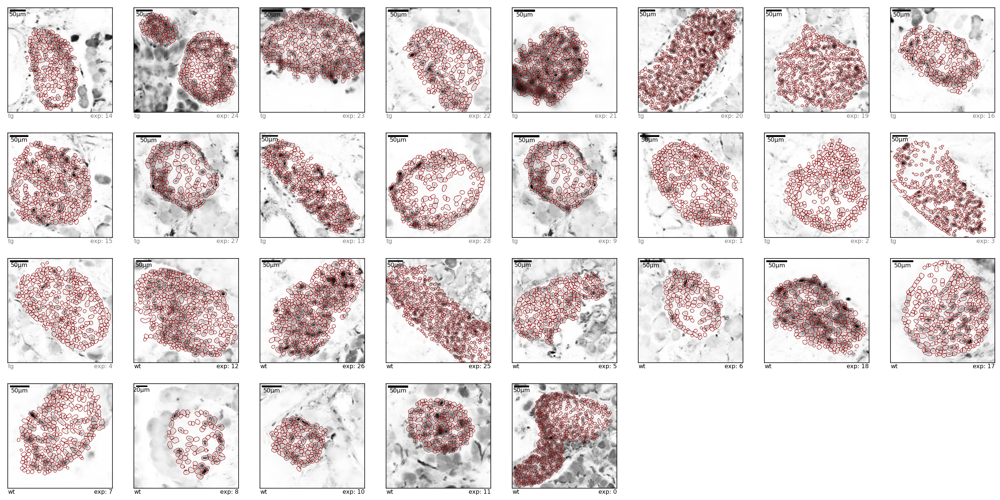


```python
for i in data.index:
    # construct events_path from the roi path
    path = data.loc[i,"path"]
    events_path = path.replace("_rois.pkl","_auto_events.csv")
    # regions are in our table now
    regions = data.loc[i,"regions"]
    # reading events each time from the file is very fast
    Events = pd.read_csv(events_path, index_col=0)
    # plot events
    fig, axs = mf.plot_events(Events, regions)
    ax = axs[0]
    var = data.loc[i,voi]
    legs = data.loc[i,"legs"]
    ax.text(0,1.3,f"{voi}: {var}  exp: {i}",size=8,va="top",transform=ax.transAxes)
    for leg in legs:
        mf.emphasize_region(ax,legs[leg],ax.get_ylim(), color=legColors[leg])
        ax.text(legs[leg][0],ax.get_ylim()[1]*.9," "+leg,va="top",color=legColors[leg])
    ax.set_ylim(ax.get_ylim()[0]*.8,None)
    plt.show()
    
```


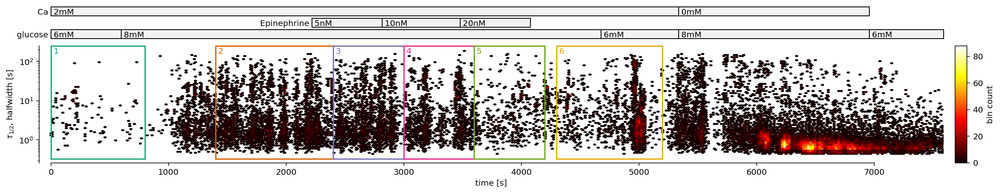


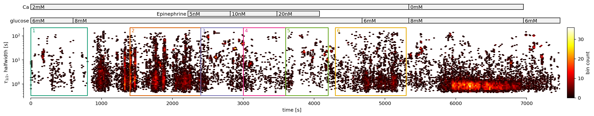


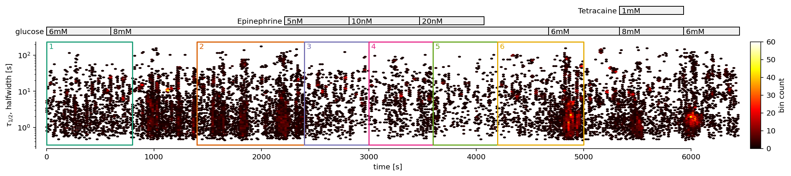


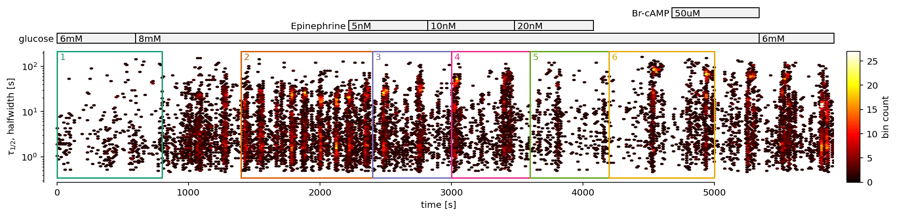


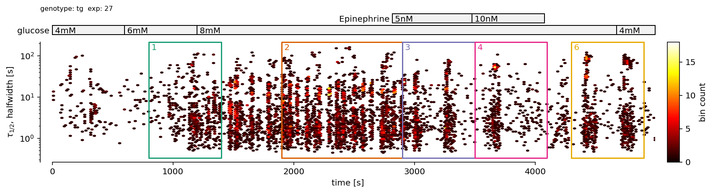


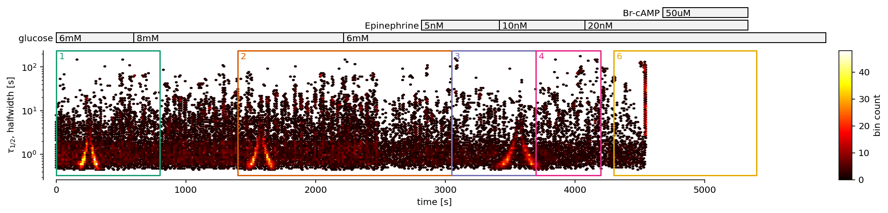


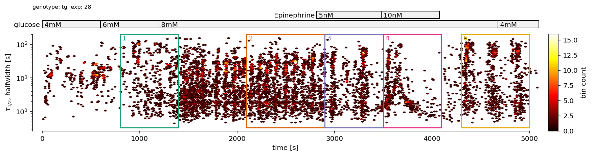


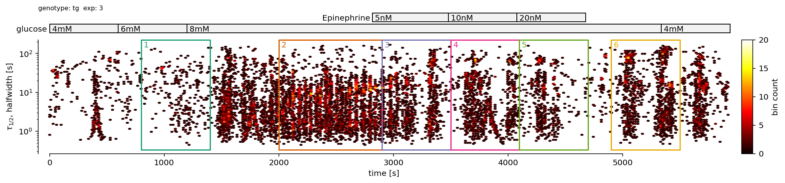


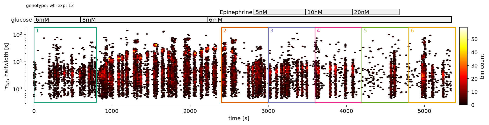


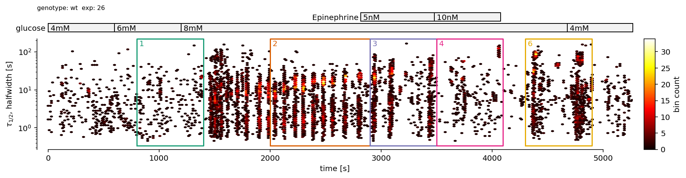


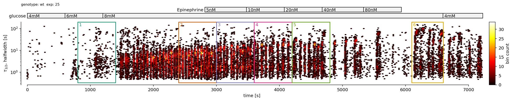


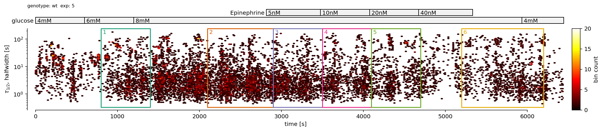


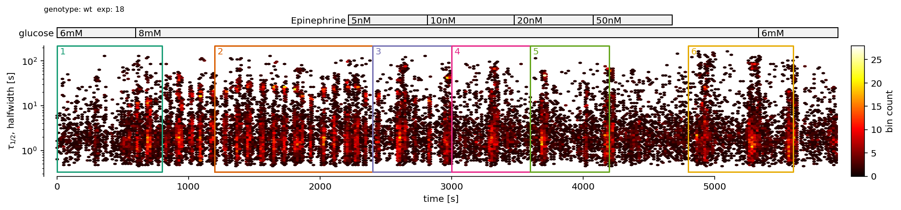


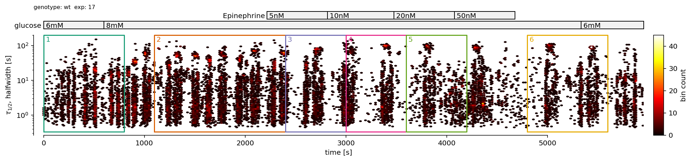


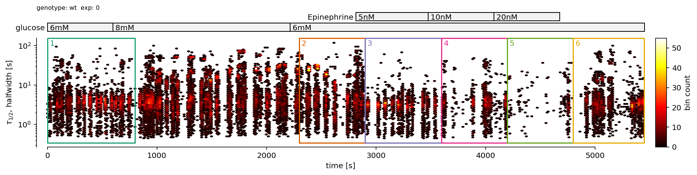


```python
hwBinEdges = np.geomspace(start = .1, stop = 1000, num = 100)
hwBinCenters = np.sqrt( hwBinEdges[1:] * hwBinEdges[:-1])
fig, axs = plt.subplots(1,2,figsize=(14,6))
axs[0].set_title("pdf")
axs[1].set_title("cdf")
for ax in axs:
    ax.set_xscale("log")
for i in data.index:
    # construct events_path from the roi path
    path = data.loc[i,"path"] 
    events_path = path.replace("_rois.pkl","_auto_events.csv")
    # reading events each time from the file is very fast
    Events = pd.read_csv(events_path, index_col=0)
    x = Events["halfwidth"].values.copy()
    h = np.histogram(x, hwBinEdges)[0]
    h = h/h.sum()
    axs[0].plot(hwBinCenters, h, label=f"exp: {i}")
    x.sort()
    axs[1].plot(x, np.linspace(0,1,len(x)), label=f"exp: {i}")
axs[0].set_ylim(0,)
axs[0].set_yticks([])
axs[0].set_ylabel("arbitrary units")
axs[1].set_ylim(0,1)
for ax in axs:
    ax.set_xlim(hwBinCenters[[0,-1]])
axs[1].legend(loc=4)
```


    <matplotlib.legend.Legend at 0x7f18a9e2c2e8>


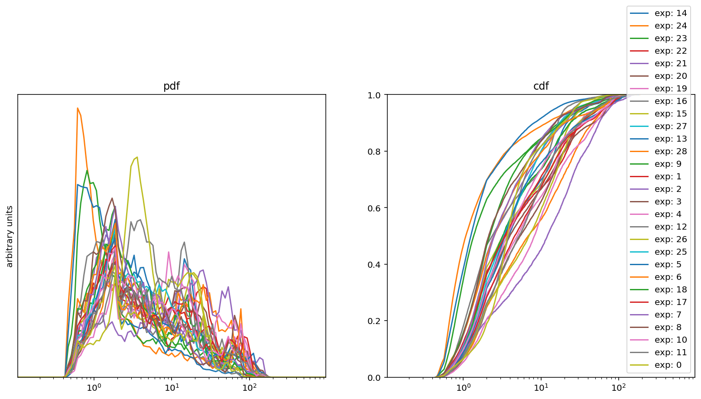


### Analysis


```python
hwRegions = {
#    "ultrashort": (0.2,1.5),
    "short": (0.5,20),
#    "long":  (20,200),
}
```


```python
# we again iterate over rows of data, this time collecting the important objects for each experiment:
allEpmpr = []
minEvents = 10
# ... 
for i in data.index:
    # ... import events, ...
    path = data.loc[i,"path"] 
    events_path = path.replace("_rois.pkl","_auto_events.csv")
    Events = pd.read_csv(events_path, index_col=0)
    # define legs
    islets.EventDistillery.define_legs(Events, data.loc[i,"legs"])
    # ... calculate events per min per active roi, ...
    evpmpar = mf.get_events_per_min_per_nrois(  # <-- see Step3 for an explanation what this does
        Events,
        hwRegions,
        minEvents=minEvents,
        reduceRois=2,
        Nbootstrap=30
    )
    # ... we label result with the experiment index
    expLabel = "exp"+str(i)
    evpmpar["experiment"] = expLabel
    evpmpar[voi] = data.loc[i,voi]
    ## and collect it into the big list
    allEpmpr += [evpmpar]
```

    There are 154 rois with more than 10 events (83%).
    Out of them, 77 are sampled 30 times to estimate mean and std of the firing rate.
    There are 225 rois with more than 10 events (85%).
    Out of them, 112 are sampled 30 times to estimate mean and std of the firing rate.
    There are 243 rois with more than 10 events (85%).
    Out of them, 121 are sampled 30 times to estimate mean and std of the firing rate.
    There are 141 rois with more than 10 events (76%).
    Out of them, 70 are sampled 30 times to estimate mean and std of the firing rate.
    There are 193 rois with more than 10 events (81%).
    Out of them, 96 are sampled 30 times to estimate mean and std of the firing rate.
    There are 245 rois with more than 10 events (67%).
    Out of them, 122 are sampled 30 times to estimate mean and std of the firing rate.
    There are 256 rois with more than 10 events (72%).
    Out of them, 128 are sampled 30 times to estimate mean and std of the firing rate.
    There are 128 rois with more than 10 events (75%).
    Out of them, 64 are sampled 30 times to estimate mean and std of the firing rate.
    There are 202 rois with more than 10 events (77%).
    Out of them, 101 are sampled 30 times to estimate mean and std of the firing rate.
    There are 96 rois with more than 10 events (73%).
    Out of them, 48 are sampled 30 times to estimate mean and std of the firing rate.
    There are 173 rois with more than 10 events (69%).
    Out of them, 86 are sampled 30 times to estimate mean and std of the firing rate.
    There are 148 rois with more than 10 events (67%).
    Out of them, 74 are sampled 30 times to estimate mean and std of the firing rate.
    There are 96 rois with more than 10 events (73%).
    Out of them, 48 are sampled 30 times to estimate mean and std of the firing rate.
    There are 210 rois with more than 10 events (69%).
    Out of them, 105 are sampled 30 times to estimate mean and std of the firing rate.
    There are 97 rois with more than 10 events (36%).
    Out of them, 48 are sampled 30 times to estimate mean and std of the firing rate.
    There are 203 rois with more than 10 events (65%).
    Out of them, 101 are sampled 30 times to estimate mean and std of the firing rate.
    There are 165 rois with more than 10 events (61%).
    Out of them, 82 are sampled 30 times to estimate mean and std of the firing rate.
    There are 277 rois with more than 10 events (87%).
    Out of them, 138 are sampled 30 times to estimate mean and std of the firing rate.
    There are 224 rois with more than 10 events (72%).
    Out of them, 112 are sampled 30 times to estimate mean and std of the firing rate.
    There are 315 rois with more than 10 events (80%).
    Out of them, 157 are sampled 30 times to estimate mean and std of the firing rate.
    There are 132 rois with more than 10 events (67%).
    Out of them, 66 are sampled 30 times to estimate mean and std of the firing rate.
    There are 96 rois with more than 10 events (79%).
    Out of them, 48 are sampled 30 times to estimate mean and std of the firing rate.
    There are 189 rois with more than 10 events (81%).
    Out of them, 94 are sampled 30 times to estimate mean and std of the firing rate.
    There are 186 rois with more than 10 events (70%).
    Out of them, 93 are sampled 30 times to estimate mean and std of the firing rate.
    There are 187 rois with more than 10 events (69%).
    Out of them, 93 are sampled 30 times to estimate mean and std of the firing rate.
    There are 60 rois with more than 10 events (74%).
    Out of them, 30 are sampled 30 times to estimate mean and std of the firing rate.
    There are 71 rois with more than 10 events (79%).
    Out of them, 35 are sampled 30 times to estimate mean and std of the firing rate.
    There are 90 rois with more than 10 events (63%).
    Out of them, 45 are sampled 30 times to estimate mean and std of the firing rate.
    There are 278 rois with more than 10 events (87%).
    Out of them, 139 are sampled 30 times to estimate mean and std of the firing rate.


```python
allEpmpr = pd.concat(allEpmpr,ignore_index=True)
```


```python
# check one by eye to make sure it makes sense
allEpmpr.query("experiment=='exp0'").sort_values(["genotype","leg"])
```


<div>
<style scoped>
    .dataframe tbody tr th:only-of-type {
        vertical-align: middle;
    }

    .dataframe tbody tr th {
        vertical-align: top;
    }

    .dataframe thead th {
        text-align: right;
    }
</style>
<table border="1" class="dataframe">
  <thead>
    <tr style="text-align: right;">
      <th></th>
      <th>hw_region</th>
      <th>leg</th>
      <th>epmpr</th>
      <th>epmpr_std</th>
      <th>experiment</th>
      <th>genotype</th>
    </tr>
  </thead>
  <tbody>
    <tr>
      <th>163</th>
      <td>short</td>
      <td>1</td>
      <td>1.205030</td>
      <td>0.036263</td>
      <td>exp0</td>
      <td>wt</td>
    </tr>
    <tr>
      <th>164</th>
      <td>short</td>
      <td>2</td>
      <td>1.565816</td>
      <td>0.063309</td>
      <td>exp0</td>
      <td>wt</td>
    </tr>
    <tr>
      <th>165</th>
      <td>short</td>
      <td>3</td>
      <td>0.953418</td>
      <td>0.028830</td>
      <td>exp0</td>
      <td>wt</td>
    </tr>
    <tr>
      <th>166</th>
      <td>short</td>
      <td>4</td>
      <td>0.568208</td>
      <td>0.022326</td>
      <td>exp0</td>
      <td>wt</td>
    </tr>
    <tr>
      <th>167</th>
      <td>short</td>
      <td>5</td>
      <td>0.098784</td>
      <td>0.008396</td>
      <td>exp0</td>
      <td>wt</td>
    </tr>
    <tr>
      <th>168</th>
      <td>short</td>
      <td>6</td>
      <td>1.116668</td>
      <td>0.035964</td>
      <td>exp0</td>
      <td>wt</td>
    </tr>
  </tbody>
</table>
</div>


```python
# allEpmpr.to_csv("events_per_min_per_active_roi.csv")
```


```python
#### Details
#mf.check_roi_heterogeneity(Events.query("halfwidth<20"),regions, boxplot_kwargs={"showfliers":False});
```


```python
exps = list(allEpmpr["experiment"].unique())
```


```python
jitter = .01 # how much you wish to stagger the points in the plot below
allEpmpr["plot_pos"] = allEpmpr["leg"].apply(lambda xi: legList.index(xi)) + allEpmpr["experiment"].apply(lambda xi: exps.index(xi)-(len(exps)-1)/2)*jitter
```


```python
rescale = 100 # rescale to values you can change it if you wish
fig, axs = plt.subplots(len(varList),len(hwRegions),figsize=(1+len(hwRegions)*len(legColors)*.5,3*len(varList)), squeeze=False, sharex="col", sharey="col")
# plt.subplots_adjust(wspace=.5, top = 1-.2/axs.shape[1], bottom = .3/axs.shape[1])

if rescale>1:
    fig.suptitle(f"events per minute per {rescale} active rois*")
else:
    fig.suptitle(f"events per minute per active roi*\n")
legNames = ["6","S","S+5","S+10","S+20","S-2"]
for i_col,hwr in enumerate(hwRegions):
    for i_row,var in enumerate(varList):
        ax = axs[i_row, i_col]
        for exp,df in allEpmpr.query(f"hw_region=='{hwr}' and {voi}=='{var}'").groupby("experiment"):
            ax.plot(df['plot_pos'],rescale*df['epmpr'], color="grey",lw=.7)
        for leg in legs:
            df = allEpmpr.query(f"hw_region=='{hwr}' and {voi}=='{var}' and leg=='{leg}'").copy()
            ax.errorbar(df['plot_pos'],df["epmpr"]*rescale,df["epmpr_std"]*rescale,color=legColors[leg], marker="o",ls="none", mec="k")
        if i_row==0:
            ax.text(0,1.03,hwr, transform=ax.transAxes)
        ax.text(1,.95,f"{voi}: {var} ", transform=ax.transAxes,ha="right")
        ax.set_xlim(-.5,int(allEpmpr["plot_pos"].max())+.5)
#         ax.set_ylim(0,)

# set the ticks:
for ax in axs.flat:
    xmax = ax.get_xlim()[1]
    ax.set_xticks(np.arange(int(xmax)+1))
    ax.set_xticklabels(legNames, rotation=0)
ax = axs[0,0]
ax.text(1,1.03,r"$\tau_{1/2}<%g$"%hwRegions["short"][1],ha="right",transform=ax.transAxes)
fig.text(0,-.01,f"*active rois are rois that have at least {minEvents} events detected",va="top", )
```


    Text(0, -0.01, '*active rois are rois that have at least 10 events detected')


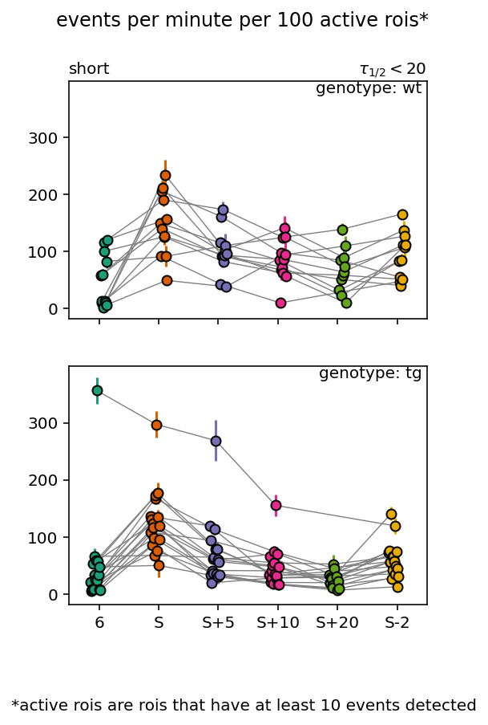


```python
from tqdm.notebook import tqdm
```


```python
# we again iterate over rows of data, this time collecting the important objects for each experiment:
allHWs = []
minEvents = 10 # minimal number of events
               # in the concrete halfwidth domain and leg.
               # you may need to go down with this number 
               # especially for some 


for i in tqdm(data.index):
    # ... import events, ...
    path = data.loc[i,"path"] 
    events_path = path.replace("_rois.pkl","_auto_events.csv")
    Events = pd.read_csv(events_path, index_col=0)
    # define legs
    legs = data.loc[i,"legs"]
    islets.EventDistillery.define_legs(Events, legs)
    Events = Events.dropna().copy()
    for hwr in hwRegions:
        hw0,hw1 = hwRegions[hwr]
        for leg in legList:
            evs = Events.query(f"halfwidth<{hw1} and halfwidth>={hw0} and leg=='{leg}'")
            x = [dfr["halfwidth"].median() for roi,dfr in evs.groupby("roi") if len(dfr)>minEvents] 
            allHWs += [{
                "experiment": "exp"+str(i),
                "leg": leg,
                voi: data.loc[i,voi],
                "halfwidth": np.mean(x),
                "halfwidth sem": np.std(x)/np.sqrt(len(x)-1),
                "hw_region": hwr,
                }]
```


      0%|          | 0/29 [00:00<?, ?it/s]


    /opt/tljh/user/envs/physio_dev/lib/python3.7/site-packages/numpy/core/fromnumeric.py:3420: RuntimeWarning: Mean of empty slice.
      out=out, **kwargs)
    /opt/tljh/user/envs/physio_dev/lib/python3.7/site-packages/numpy/core/_methods.py:188: RuntimeWarning: invalid value encountered in double_scalars
      ret = ret.dtype.type(ret / rcount)
    /opt/tljh/user/envs/physio_dev/lib/python3.7/site-packages/numpy/core/_methods.py:262: RuntimeWarning: Degrees of freedom <= 0 for slice
      keepdims=keepdims, where=where)
    /opt/tljh/user/envs/physio_dev/lib/python3.7/site-packages/numpy/core/_methods.py:222: RuntimeWarning: invalid value encountered in true_divide
      subok=False)
    /opt/tljh/user/envs/physio_dev/lib/python3.7/site-packages/numpy/core/_methods.py:253: RuntimeWarning: invalid value encountered in double_scalars
      ret = ret.dtype.type(ret / rcount)
    /opt/tljh/user/envs/physio_dev/lib/python3.7/site-packages/ipykernel_launcher.py:24: RuntimeWarning: invalid value encountered in sqrt
    /opt/tljh/user/envs/physio_dev/lib/python3.7/site-packages/ipykernel_launcher.py:24: RuntimeWarning: invalid value encountered in double_scalars


```python
allHWs = pd.DataFrame(allHWs)
```


```python
allHWs.query("experiment=='exp0'")
```


<div>
<style scoped>
    .dataframe tbody tr th:only-of-type {
        vertical-align: middle;
    }

    .dataframe tbody tr th {
        vertical-align: top;
    }

    .dataframe thead th {
        text-align: right;
    }
</style>
<table border="1" class="dataframe">
  <thead>
    <tr style="text-align: right;">
      <th></th>
      <th>experiment</th>
      <th>leg</th>
      <th>genotype</th>
      <th>halfwidth</th>
      <th>halfwidth sem</th>
      <th>hw_region</th>
    </tr>
  </thead>
  <tbody>
    <tr>
      <th>168</th>
      <td>exp0</td>
      <td>1</td>
      <td>wt</td>
      <td>3.528363</td>
      <td>0.058752</td>
      <td>short</td>
    </tr>
    <tr>
      <th>169</th>
      <td>exp0</td>
      <td>2</td>
      <td>wt</td>
      <td>3.767951</td>
      <td>0.068134</td>
      <td>short</td>
    </tr>
    <tr>
      <th>170</th>
      <td>exp0</td>
      <td>3</td>
      <td>wt</td>
      <td>3.149763</td>
      <td>0.046959</td>
      <td>short</td>
    </tr>
    <tr>
      <th>171</th>
      <td>exp0</td>
      <td>4</td>
      <td>wt</td>
      <td>3.451205</td>
      <td>0.124492</td>
      <td>short</td>
    </tr>
    <tr>
      <th>172</th>
      <td>exp0</td>
      <td>5</td>
      <td>wt</td>
      <td>NaN</td>
      <td>NaN</td>
      <td>short</td>
    </tr>
    <tr>
      <th>173</th>
      <td>exp0</td>
      <td>6</td>
      <td>wt</td>
      <td>3.246554</td>
      <td>0.053565</td>
      <td>short</td>
    </tr>
  </tbody>
</table>
</div>


```python
jitter = .01 # how much you wish to stagger the points in the plot below
allHWs["plot_pos"] = allHWs["leg"].apply(lambda xi: legList.index(xi)) + allHWs["experiment"].apply(lambda xi: exps.index(xi)-(len(exps)-1)/2)*jitter
```


```python
fig, axs = plt.subplots(len(varList),len(hwRegions),figsize=(1+len(hwRegions)*len(legColors)*.5,3*len(varList)), squeeze=False, sharex="col", sharey="col")
# plt.subplots_adjust(wspace=.5, top = 1-.2/axs.shape[1], bottom = .3/axs.shape[1])

fig.suptitle(f"median active rois*")

legNames = ["6","S","S+5","S+10","S+20","S-2"]
for i_col,hwr in enumerate(hwRegions):
    for i_row,var in enumerate(varList):
        ax = axs[i_row, i_col]
        for exp,df in allHWs.query(f"hw_region=='{hwr}' and {voi}=='{var}'").groupby("experiment"):
            df = df.copy().dropna()
            ax.plot(df['plot_pos'],df['halfwidth'], color="grey",lw=.7)
        for leg in legs:
            df = allHWs.query(f"hw_region=='{hwr}' and {voi}=='{var}' and leg=='{leg}'").copy()
            ax.errorbar(df['plot_pos'], df["halfwidth"], df["halfwidth sem"], color=legColors[leg], marker="o",ls="none", mec="k")
        if i_row==0:
            ax.text(0,1.03,hwr, transform=ax.transAxes)
        ax.text(1,.95,f"{voi}: {var} ", transform=ax.transAxes,ha="right")
        ax.set_xlim(-.5,int(allHWs["plot_pos"].max())+.5)
#         ax.set_ylim(0,)

# set the ticks:
for ax in axs.flat:
    xmax = ax.get_xlim()[1]
    ax.set_xticks(np.arange(int(xmax)+1))
    ax.set_xticklabels(legNames, rotation=0)
ax = axs[0,0]
ax.text(1,1.03,r"$\tau_{1/2}<%g$"%hwRegions["short"][1],ha="right",transform=ax.transAxes)
fig.text(0,-.01,f"*active rois are rois that have at least {minEvents} events detected",va="top", )
```


    Text(0, -0.01, '*active rois are rois that have at least 10 events detected')


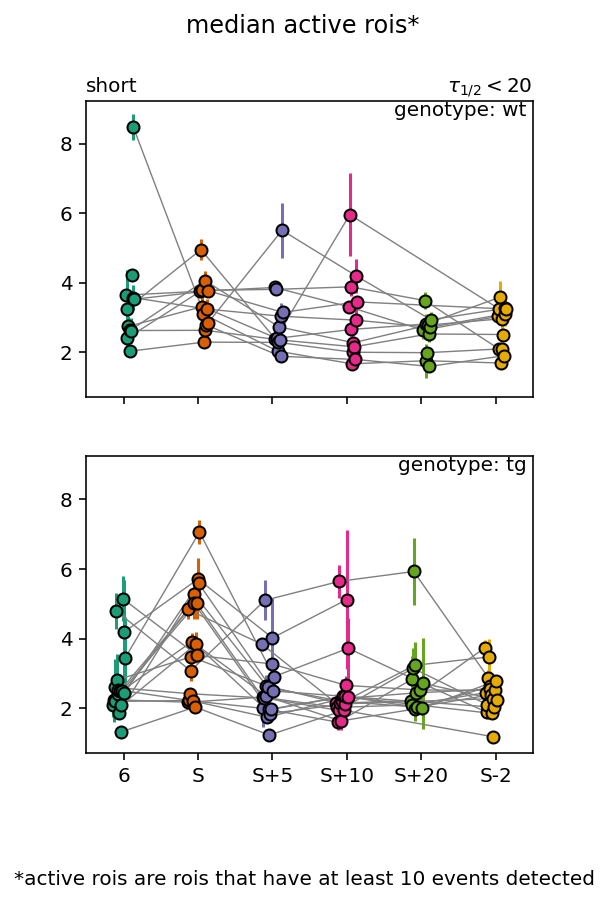

